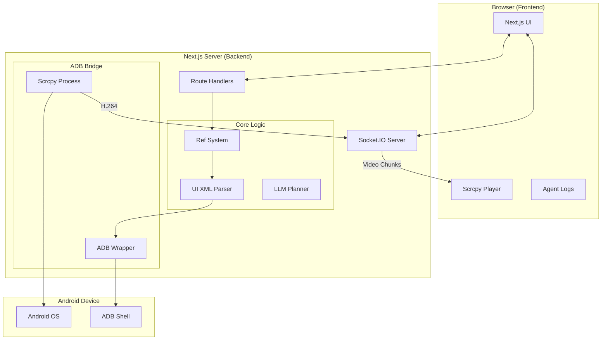

# TUTAN_AGENT Next.js 全栈开发路线图 (对齐 OpenClaw)

> **核心目标**: 在不依赖独立 Android App 的前提下，仅通过 ADB 实现 OpenClaw 级别的 Android GUI 自动化能力。
> **技术底座**: Next.js 14 (App Router) + TypeScript + ADB + Scrcpy

---

## 0. 为什么之前写了 Android App？
之前的 `android-app` 主要作用是提供**更深度的感知**和**更快的执行**：
1. **感知**: 某些 App 的 UI 树通过 `adb shell uiautomator dump` 获取非常慢（2-5秒），而 App 内直接调用 Accessibility API 是毫秒级的。
2. **执行**: `adb shell input tap` 比较慢，App 内执行手势可以模拟更复杂的滑动和多点触控。
3. **绕过限制**: 部分系统页面或安全页面会屏蔽 ADB 操作，但无法屏蔽无障碍服务。

**既然您希望先用 ADB 实现，我们将把重心转移到“ADB 性能榨取”和“后端感知模拟”上。**

---

## 1. 核心能力对齐矩阵

| OpenClaw 核心能力 | TUTAN_AGENT (ADB 版) 实现方案 |
| :--- | :--- |
| **Aria Snapshot** | 通过 `adb shell uiautomator dump` 获取 XML 并解析为 JSON 树 |
| **Semantic Ref System** | 在 Next.js 后端实现 XML 到 `e1, e2` 的映射逻辑 |
| **Hybrid Control** | 封装 `adb shell input` (tap, swipe, text, keyevent) |
| **Live Canvas** | 集成 `scrcpy-server`，通过 WebSocket 转发 H.264 流到前端 |
| **Agent Streaming** | 使用 Next.js Route Handlers + Server-Sent Events (SSE) |
| **Multi-Profile** | 基于 ADB Serial 实现多设备并发控制与状态隔离 |

---

## 2. 开发阶段规划 (Phases)

### Phase 1: 增强型感知系统 (Perception)
**目标**: 实现稳定、快速的 UI 树获取与 Ref 映射。
- [ ] **XML 解析器**: 编写高性能的 Android UI XML 解析器，将其转换为 OpenClaw 格式的 JSON。
- [ ] **Ref 映射逻辑**: 实现 `RefSystem` 类，支持 `[e1]`, `[e2]` 的生成、缓存与坐标反查。
- [ ] **感知优化**: 探索 `adb shell uiautomator dump` 的加速方案（如使用 `yadb` 或压缩传输）。

### Phase 2: 实时画面流集成 (Live Stream)
**目标**: 在 Web 界面实时看到手机画面（对齐 OpenClaw Canvas）。
- [ ] **Scrcpy 桥接**: 在 Next.js (Node.js) 中启动 `scrcpy-server`。
- [ ] **流转发**: 建立 Socket.IO 频道，将原始视频流转发至前端。
- [ ] **前端渲染**: 使用 `webcodecs` 或 `broadway.js` 在浏览器中解码并渲染画面。

### Phase 3: 交互与动作系统 (Interaction)
**目标**: 封装高可靠性的交互指令。
- [ ] **原子动作库**: 封装 `click(ref_id)`, `type(ref_id, text)`, `scroll(dir)`, `long_press(ref_id)`。
- [ ] **坐标自动转换**: 根据 Ref ID 自动计算 UI 元素的中心坐标。
- [ ] **输入法优化**: 自动切换到 ADB Keyboard 以支持中文输入。

### Phase 4: Agent 决策大脑 (Reasoning)
**目标**: 接入 LLM 并实现任务闭环。
- [ ] **OpenClaw 提示词对齐**: 移植 OpenClaw 的 System Prompt 策略。
- [ ] **SSE 流式响应**: 实现 Agent 思考过程的流式推送。
- [ ] **任务历史管理**: 自动维护会话上下文，支持任务中止与恢复。

### Phase 5: 现代化控制台 (UI/UX)
**目标**: 提供极致的操作体验。
- [ ] **多设备面板**: 支持在多个手机间快速切换。
- [ ] **视觉调试工具**: 在实时画面上覆盖 Ref ID 标签（类似 Chrome DevTools）。
- [ ] **链路诊断**: 实时显示 ADB 状态、延迟和模型响应时间。

---

## 3. 架构设计图 (Phase 1-3 Focus)

---

## 4. 后续着手点 (Immediate Actions)

1. **重构 `src/lib/adb.ts`**: 编写更健壮的 ADB 命令封装，支持 XML Dump。
2. **实现 `src/lib/xml-parser.ts`**: 将 Android 的 XML 转换为 Ref 节点。
3. **更新 `src/app/api/agents/run`**: 接入真实的感知数据流。

**如果您确认这个路线图，我将首先开始 Phase 1 的开发，重点攻克“通过 ADB 高效获取并解析 UI 树”这一难点。**
