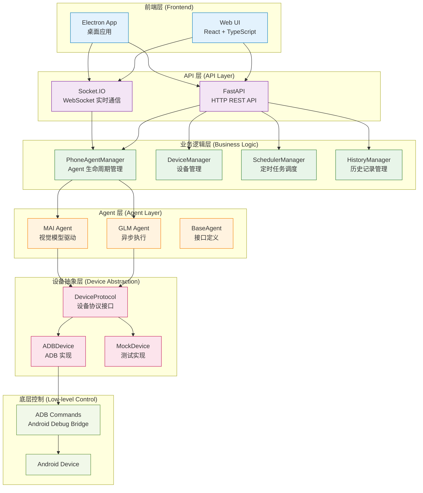
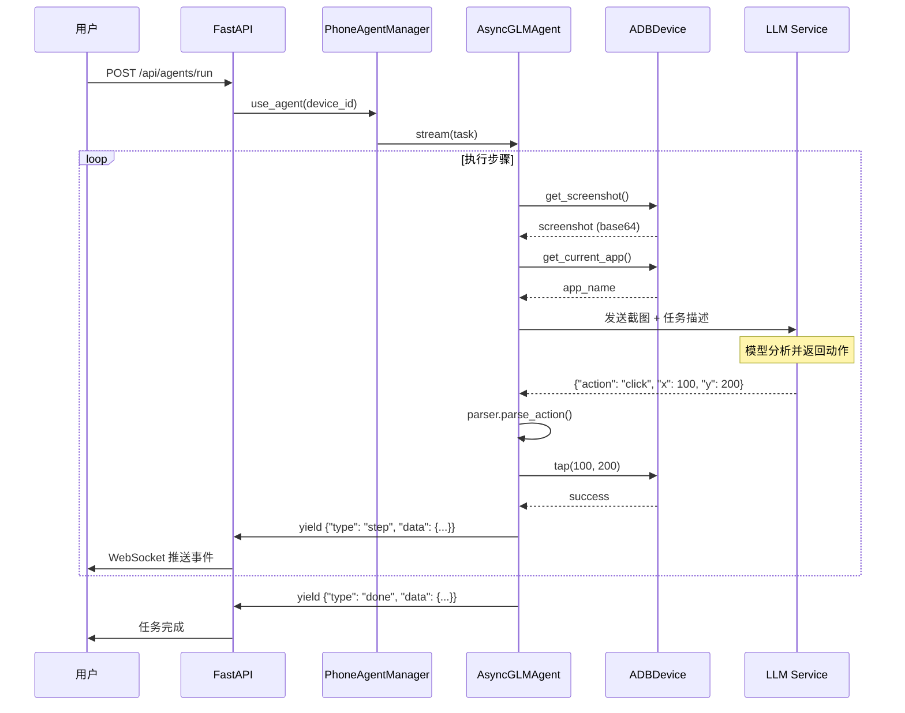
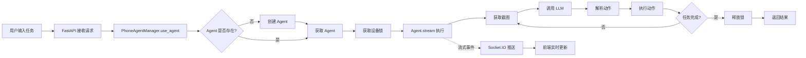
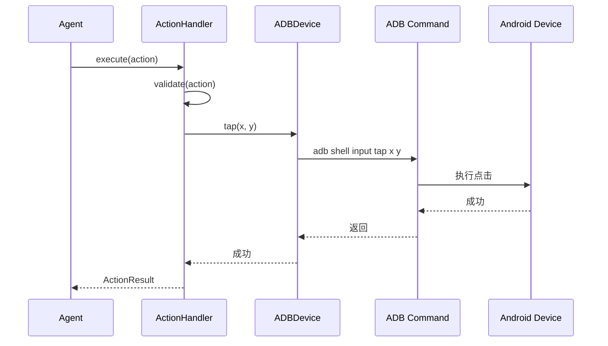

# AutoGLM-GUI 工程架构解析文档

> **版本**: 基于 AutoGLM-GUI v1.5.8  
> **目标**: 深入理解 AutoGLM-GUI 的架构设计、核心模块和实现细节

---

## 目录

1. [项目概览](#1-项目概览)
2. [整体架构](#2-整体架构)
3. [核心模块详解](#3-核心模块详解)
4. [Agent 系统](#4-agent-系统)
5. [设备管理](#5-设备管理)
6. [API 层设计](#6-api-层设计)
7. [数据流与执行流程](#7-数据流与执行流程)
8. [扩展点与最佳实践](#8-扩展点与最佳实践)

---

## 1. 项目概览

### 1.1 项目定位

AutoGLM-GUI 是一个**AI 驱动的 Android 自动化工具**，具有以下特点：

- **后端**: Python 3.10+ (FastAPI + Socket.IO)
- **前端**: React + TypeScript (Vite)
- **桌面应用**: Electron
- **核心能力**: 通过 AI Agent 自动控制 Android 设备

### 1.2 技术栈

**后端技术栈**:
- **Web 框架**: FastAPI (异步 HTTP API)
- **实时通信**: python-socketio (WebSocket 双向通信)
- **AI 客户端**: openai (兼容 OpenAI API 的模型服务)
- **任务调度**: APScheduler (Cron 风格定时任务)
- **设备控制**: ADB (Android Debug Bridge)
- **日志系统**: loguru

**前端技术栈**:
- **框架**: React + TypeScript
- **构建工具**: Vite
- **UI 库**: 自定义组件库
- **实时通信**: Socket.IO Client

### 1.3 项目结构

```
AutoGLM-GUI/
├── AutoGLM_GUI/              # Python 后端核心代码
│   ├── __init__.py          # 包初始化（Windows 编码修复）
│   ├── __main__.py          # CLI 入口
│   ├── server.py            # ASGI 应用入口（FastAPI + Socket.IO）
│   │
│   ├── api/                 # FastAPI 路由模块
│   │   ├── agents.py        # Agent 相关 API
│   │   ├── devices.py       # 设备管理 API
│   │   ├── control.py       # 设备控制 API
│   │   ├── history.py        # 历史记录 API
│   │   ├── scheduled_tasks.py # 定时任务 API
│   │   └── ...
│   │
│   ├── agents/              # Agent 实现
│   │   ├── protocols.py    # Agent 接口定义（BaseAgent/AsyncAgent）
│   │   ├── factory.py       # Agent 工厂模式
│   │   ├── glm/            # GLM Agent 实现
│   │   │   ├── async_agent.py    # 异步 GLM Agent
│   │   │   ├── parser.py         # 动作解析器
│   │   │   └── message_builder.py # 消息构建器
│   │   └── mai/             # MAI Agent 实现
│   │
│   ├── devices/             # 设备抽象层
│   │   ├── adb_device.py   # ADB 设备实现
│   │   ├── mock_device.py  # Mock 设备（测试用）
│   │   └── remote_device.py # 远程设备
│   │
│   ├── device_protocol.py   # 设备协议接口定义
│   ├── device_manager.py    # 设备管理器（多设备、连接管理）
│   ├── phone_agent_manager.py # Agent 生命周期管理器
│   │
│   ├── adb/                 # ADB 底层封装
│   │   ├── device.py        # 设备信息
│   │   ├── input.py        # 输入操作（tap/swipe/type）
│   │   ├── screenshot.py   # 截图功能
│   │   └── apps.py         # 应用包名映射
│   │
│   ├── actions/             # 动作处理
│   │   ├── handler.py      # 动作执行器
│   │   └── types.py        # 动作类型定义
│   │
│   ├── config.py           # 配置类定义（ModelConfig/AgentConfig）
│   ├── logger.py           # 日志配置
│   └── ...
│
├── frontend/                # React 前端
│   ├── src/
│   │   ├── main.tsx        # 入口文件
│   │   ├── routes/         # 路由页面
│   │   └── components/     # UI 组件
│   └── ...
│
├── electron/               # Electron 桌面应用
└── scripts/                # 构建和工具脚本
```

---

## 2. 整体架构

### 2.1 架构分层图



### 2.2 核心设计原则

1. **协议驱动**: 使用 Protocol（接口）定义抽象层，实现与具体实现解耦
2. **单例模式**: PhoneAgentManager 和 DeviceManager 使用单例模式，确保全局唯一
3. **异步优先**: 核心 Agent 使用异步实现，支持流式输出和立即取消
4. **设备抽象**: DeviceProtocol 抽象设备操作，支持 ADB、Mock、Remote 等多种实现

---

## 3. 核心模块详解

### 3.1 Device Protocol（设备协议）

**位置**: `AutoGLM_GUI/device_protocol.py`

这是整个系统的**设备抽象层**，定义了所有设备必须实现的接口。

**核心接口**:

```python
@runtime_checkable
class DeviceProtocol(Protocol):
    """设备操作协议 - 所有设备实现必须遵循此接口"""
    
    @property
    def device_id(self) -> str: ...
    
    # 截图
    def get_screenshot(self, timeout: int = 10) -> Screenshot: ...
    
    # 输入操作
    def tap(self, x: int, y: int, delay: float | None = None) -> None: ...
    def swipe(self, start_x: int, start_y: int, end_x: int, end_y: int, ...) -> None: ...
    def type_text(self, text: str) -> None: ...
    
    # 导航
    def back(self, delay: float | None = None) -> None: ...
    def home(self, delay: float | None = None) -> None: ...
    def launch_app(self, app_name: str, delay: float | None = None) -> bool: ...
    
    # 状态查询
    def get_current_app(self) -> str: ...
```

**设计优势**:
- **多态支持**: Agent 不需要知道具体是 ADB 还是其他实现
- **易于测试**: 可以使用 MockDevice 进行单元测试
- **易于扩展**: 可以轻松添加 AccessibilityService、UIAutomator 等实现

### 3.2 Device Manager（设备管理器）

**位置**: `AutoGLM_GUI/device_manager.py`

负责管理所有连接的 Android 设备，包括：

**核心功能**:

1. **设备发现与连接**
   - USB 设备自动检测
   - WiFi ADB 连接
   - mDNS 自动发现（局域网设备）

2. **多连接支持**
   - 一个设备可以有多个连接方式（USB + WiFi）
   - 自动选择最佳连接（优先级：USB > WiFi > Remote）

3. **状态管理**
   - 设备状态：ONLINE / OFFLINE / DISCONNECTED
   - 后台轮询检测设备状态
   - 连接状态缓存

**关键数据结构**:

```python
@dataclass
class ManagedDevice:
    """设备信息（按 serial 聚合，支持多连接）"""
    serial: str                    # 硬件序列号
    connections: list[DeviceConnection]  # 多个连接方式
    primary_connection_idx: int    # 主连接索引
    state: DeviceState             # 设备状态
    model: Optional[str]           # 设备型号
    display_name: Optional[str]    # 用户自定义名称
```

### 3.3 Phone Agent Manager（Agent 生命周期管理器）

**位置**: `AutoGLM_GUI/phone_agent_manager.py`

这是整个系统的**核心协调器**，负责 Agent 的创建、销毁和并发控制。

**核心职责**:

1. **Agent 生命周期管理**
   - 按设备创建 Agent（一个设备一个 Agent）
   - Agent 初始化、重置、销毁
   - 状态跟踪（IDLE / BUSY / ERROR / INITIALIZING）

2. **并发控制**
   - **设备级锁**: 每个设备有独立的锁，确保同一设备不会并发执行任务
   - **线程安全**: 使用 RLock 保护内部状态

3. **流式执行支持**
   - 支持异步流式 Agent（AsyncAgent）
   - 支持同步 Agent（BaseAgent）
   - 自动适配不同的 Agent 类型

**关键方法**:

```python
class PhoneAgentManager:
    @classmethod
    def get_instance(cls) -> PhoneAgentManager:
        """单例模式获取实例"""
    
    def initialize_agent_with_factory(...) -> Agent:
        """使用工厂模式创建 Agent"""
    
    @contextmanager
    def use_agent(self, device_id: str):
        """上下文管理器，自动加锁和解锁"""
        # 使用示例：
        # with manager.use_agent(device_id) as agent:
        #     result = agent.run("打开微信")
    
    def get_agent_state(self, device_id: str) -> AgentState:
        """获取 Agent 状态"""
```

**设计亮点**:
- **上下文管理器**: 使用 `with` 语句自动管理锁，避免死锁
- **工厂模式**: 支持多种 Agent 类型（GLM、MAI 等）
- **状态机**: 清晰的 Agent 状态转换

---

## 4. Agent 系统

### 4.1 Agent 接口定义

**位置**: `AutoGLM_GUI/agents/protocols.py`

AutoGLM-GUI 定义了两种 Agent 接口：

**1. BaseAgent（同步 Agent）**

```python
class BaseAgent(Protocol):
    """同步 Agent 接口"""
    
    def run(self, task: str) -> str:
        """运行完整任务，返回最终结果"""
    
    def step(self, task: str | None = None) -> StepResult:
        """执行单步，返回步骤结果"""
    
    def reset(self) -> None:
        """重置 Agent 状态"""
    
    @property
    def step_count(self) -> int: ...
    
    @property
    def is_running(self) -> bool: ...
```

**2. AsyncAgent（异步 Agent）**

```python
class AsyncAgent(Protocol):
    """异步 Agent 接口（推荐）"""
    
    async def run(self, task: str) -> str:
        """运行完整任务"""
    
    def stream(self, task: str) -> AsyncIterator[dict[str, Any]]:
        """流式执行任务，返回异步生成器"""
        # 事件类型：
        # - "thinking": {"chunk": str}  # 思考过程片段
        # - "step": {"step": int, "thinking": str, "action": dict, ...}
        # - "done": {"message": str, "steps": int, "success": bool}
        # - "cancelled": {"message": str}
        # - "error": {"message": str}
    
    async def cancel(self) -> None:
        """立即取消当前执行"""
```

### 4.2 GLM Agent 实现

**位置**: `AutoGLM_GUI/agents/glm/async_agent.py`

这是主要的 Agent 实现，使用 GLM 模型进行任务规划。

**执行流程**:



**核心代码结构**:

```python
class AsyncGLMAgent(AsyncAgent):
    def __init__(
        self,
        model_config: ModelConfig,      # 模型配置
        agent_config: AgentConfig,      # Agent 配置
        device: DeviceProtocol,         # 设备实例
        confirmation_callback: Callable | None = None,
        takeover_callback: Callable | None = None,
    ):
        self.openai_client = AsyncOpenAI(...)  # OpenAI 兼容客户端
        self.parser = GLMParser()              # 动作解析器
        self.device = device                   # 设备实例
        self.action_handler = ActionHandler(...)  # 动作执行器
        self._context: list[dict] = []         # 对话上下文
    
    async def stream(self, task: str) -> AsyncIterator[dict]:
        """流式执行任务"""
        # 1. 初始化：获取截图，添加用户消息
        screenshot = await asyncio.to_thread(self.device.get_screenshot)
        self._context.append(create_user_message(task, screenshot))
        
        # 2. 循环执行步骤
        while self._step_count < max_steps:
            async for event in self._execute_step_async():
                yield event  # 流式输出事件
            
            if finished:
                break
    
    async def _execute_step_async(self) -> AsyncIterator[dict]:
        """执行单步"""
        # 1. 获取当前屏幕
        screenshot = await asyncio.to_thread(self.device.get_screenshot)
        
        # 2. 调用 LLM
        response = await self.openai_client.chat.completions.create(
            model=self.model_config.model_name,
            messages=self._context,
            stream=True,  # 流式输出
        )
        
        # 3. 解析动作
        action = self.parser.parse(response)
        
        # 4. 执行动作
        result = await self.action_handler.execute(action)
        
        # 5. 更新上下文
        self._context.append(create_assistant_message(...))
```

### 4.3 动作解析器（Parser）

**位置**: `AutoGLM_GUI/agents/glm/parser.py`

负责将 LLM 的文本响应解析为结构化动作。

**支持的动作类型**:
- `click(x, y)`: 点击坐标
- `swipe(start_x, start_y, end_x, end_y)`: 滑动
- `type(text)`: 输入文本
- `back()`: 返回
- `home()`: 回到主页
- `launch_app(app_name)`: 启动应用
- `finish(message)`: 任务完成

**解析逻辑**:
- 使用正则表达式匹配动作格式
- 支持中英文动作描述
- 容错处理（模糊匹配）

### 4.4 动作执行器（Action Handler）

**位置**: `AutoGLM_GUI/actions/handler.py`

负责执行解析后的动作。

**核心功能**:
- 动作验证（坐标范围检查）
- 动作执行（调用 DeviceProtocol）
- 结果反馈（成功/失败）
- 回调支持（confirmation_callback, takeover_callback）

---

## 5. 设备管理

### 5.1 ADB Device 实现

**位置**: `AutoGLM_GUI/devices/adb_device.py`

这是 DeviceProtocol 的 ADB 实现，通过 ADB 命令控制 Android 设备。

**实现方式**:

```python
class ADBDevice(DeviceProtocol):
    def __init__(self, device_id: str):
        self._device_id = device_id
    
    def get_screenshot(self, timeout: int = 10) -> Screenshot:
        """通过 ADB 获取截图"""
        result = adb.get_screenshot(self._device_id, timeout)
        return Screenshot(
            base64_data=result.base64_data,
            width=result.width,
            height=result.height,
        )
    
    def tap(self, x: int, y: int, delay: float | None = None) -> None:
        """通过 ADB 执行点击"""
        adb.tap(x, y, self._device_id, delay)
        # 底层调用: adb shell input tap <x> <y>
```

### 5.2 ADB 底层封装

**位置**: `AutoGLM_GUI/adb/`

提供 ADB 命令的 Python 封装：

- **`device.py`**: 设备信息查询
- **`input.py`**: 输入操作（tap, swipe, type_text）
- **`screenshot.py`**: 截图功能
- **`apps.py`**: 应用包名映射（中文名 → 包名）
- **`connection.py`**: 连接管理

**关键特性**:
- **跨平台支持**: Windows/macOS/Linux
- **编码处理**: Windows 下自动使用 UTF-8 编码
- **超时控制**: 所有操作都有超时保护

---

## 6. API 层设计

### 6.1 FastAPI 路由结构

**位置**: `AutoGLM_GUI/api/`

AutoGLM-GUI 使用 FastAPI 提供 RESTful API：

**主要路由模块**:

| 模块 | 路径 | 功能 |
|-----|------|------|
| `agents.py` | `/api/agents/*` | Agent 创建、运行、停止 |
| `devices.py` | `/api/devices/*` | 设备列表、连接、断开 |
| `control.py` | `/api/control/*` | 设备直接控制（tap/swipe） |
| `history.py` | `/api/history/*` | 历史记录查询 |
| `scheduled_tasks.py` | `/api/scheduled-tasks/*` | 定时任务管理 |
| `workflows.py` | `/api/workflows/*` | 工作流管理 |
| `mcp.py` | `/api/mcp/*` | MCP 协议支持 |

### 6.2 Socket.IO 实时通信

**位置**: `AutoGLM_GUI/socketio_server.py`

用于实时推送 Agent 执行事件：

**事件类型**:
- `agent:thinking`: Agent 思考过程
- `agent:step`: 步骤完成
- `agent:done`: 任务完成
- `agent:error`: 错误信息
- `device:status`: 设备状态变化

**使用场景**:
- 前端实时显示 Agent 执行过程
- 推送截图和动作信息
- 任务进度更新

### 6.3 API 设计模式

**统一响应格式**:

```python
# 成功响应
{
    "success": true,
    "data": {...},
    "message": "操作成功"
}

# 错误响应
{
    "success": false,
    "error": {
        "code": "DEVICE_NOT_FOUND",
        "message": "设备未找到"
    }
}
```

**异步支持**:
- 所有 Agent 相关 API 都支持异步执行
- 使用 WebSocket 推送实时结果
- 支持任务取消

---

## 7. 数据流与执行流程

### 7.1 完整任务执行流程



### 7.2 设备控制流程



### 7.3 状态管理

**Agent 状态机**:

```
IDLE → INITIALIZING → IDLE
  ↓
BUSY → IDLE (成功)
  ↓
ERROR → IDLE (重置后)
```

**设备状态机**:

```
DISCONNECTED → ONLINE (连接成功)
  ↓
ONLINE → OFFLINE (设备无响应)
  ↓
OFFLINE → ONLINE (恢复响应)
```

---

## 8. 扩展点与最佳实践

### 8.1 如何添加新的 Agent 类型

**步骤 1**: 实现 Agent 接口

```python
# AutoGLM_GUI/agents/custom/agent.py
from AutoGLM_GUI.agents.protocols import AsyncAgent

class CustomAgent(AsyncAgent):
    def __init__(self, model_config, agent_config, device):
        self.model_config = model_config
        self.agent_config = agent_config
        self.device = device
        # ... 初始化代码
    
    async def stream(self, task: str) -> AsyncIterator[dict]:
        # ... 实现流式执行逻辑
        yield {"type": "thinking", "data": {"chunk": "..."}}
        yield {"type": "step", "data": {...}}
        yield {"type": "done", "data": {...}}
    
    async def cancel(self) -> None:
        # ... 实现取消逻辑
```

**步骤 2**: 注册到工厂

```python
# AutoGLM_GUI/agents/factory.py
from AutoGLM_GUI.agents.custom.agent import CustomAgent

def register_agent(agent_type: str, creator: Callable):
    # 注册自定义 Agent
    register_agent("custom", lambda *args, **kwargs: CustomAgent(*args, **kwargs))
```

### 8.2 如何添加新的设备实现

**步骤 1**: 实现 DeviceProtocol

```python
# AutoGLM_GUI/devices/accessibility_device.py
from AutoGLM_GUI.device_protocol import DeviceProtocol, Screenshot

class AccessibilityDevice(DeviceProtocol):
    def __init__(self, device_id: str):
        self._device_id = device_id
        self._client = AccessibilityClient(device_id)
    
    def get_screenshot(self, timeout: int = 10) -> Screenshot:
        # 通过 AccessibilityService 获取截图
        return self._client.get_screenshot()
    
    def tap(self, x: int, y: int, delay: float | None = None) -> None:
        # 通过 AccessibilityService 执行点击
        self._client.tap(x, y)
```

**步骤 2**: 在 DeviceManager 中支持

```python
# AutoGLM_GUI/device_manager.py
def get_device(self, device_id: str) -> DeviceProtocol:
    # 根据配置选择设备实现
    if use_accessibility:
        return AccessibilityDevice(device_id)
    else:
        return ADBDevice(device_id)
```

### 8.3 最佳实践

1. **使用上下文管理器**
   ```python
   # ✅ 推荐：自动管理锁
   with manager.use_agent(device_id) as agent:
       result = agent.run("打开微信")
   
   # ❌ 不推荐：手动管理锁
   agent = manager.get_agent(device_id)
   try:
       result = agent.run("打开微信")
   finally:
       manager.release_agent(device_id)
   ```

2. **异步优先**
   ```python
   # ✅ 推荐：使用异步 Agent
   agent = AsyncGLMAgent(...)
   async for event in agent.stream(task):
       print(event)
   
   # ❌ 不推荐：阻塞式执行
   agent = SyncAgent(...)
   result = agent.run(task)  # 阻塞
   ```

3. **错误处理**
   ```python
   try:
       async for event in agent.stream(task):
           if event["type"] == "error":
               logger.error(event["data"]["message"])
   except asyncio.CancelledError:
       logger.info("任务被取消")
   except Exception as e:
       logger.exception(f"任务执行失败: {e}")
   ```

---

## 9. 关键设计模式

### 9.1 单例模式

**PhoneAgentManager** 和 **DeviceManager** 使用单例模式：

```python
class PhoneAgentManager:
    _instance: Optional[PhoneAgentManager] = None
    _instance_lock = threading.Lock()
    
    @classmethod
    def get_instance(cls) -> PhoneAgentManager:
        if cls._instance is None:
            with cls._instance_lock:
                if cls._instance is None:
                    cls._instance = cls()
        return cls._instance
```

### 9.2 工厂模式

**Agent 创建**使用工厂模式：

```python
def create_agent(
    agent_type: str,
    model_config: ModelConfig,
    agent_config: AgentConfig,
    device: DeviceProtocol,
) -> Agent:
    creator = _agent_creators.get(agent_type)
    if not creator:
        raise ValueError(f"Unknown agent type: {agent_type}")
    return creator(model_config, agent_config, device)
```

### 9.3 策略模式

**设备实现**使用策略模式（通过 Protocol 接口）：

```python
# Agent 不需要知道具体设备实现
def execute_task(agent: Agent, device: DeviceProtocol):
    # device 可以是 ADBDevice、AccessibilityDevice、MockDevice 等
    screenshot = device.get_screenshot()
    agent.process(screenshot)
```

---

## 10. 总结

### 10.1 核心优势

1. **清晰的架构分层**: Protocol → Implementation → Manager
2. **强大的抽象能力**: DeviceProtocol 支持多种设备实现
3. **完善的并发控制**: 设备级锁 + 线程安全
4. **灵活的扩展性**: 工厂模式 + 接口驱动

### 10.2 学习要点

1. **理解 Protocol 的作用**: 如何通过接口实现多态
2. **掌握单例模式**: 全局状态管理的最佳实践
3. **理解异步编程**: async/await 在 Agent 中的应用
4. **理解上下文管理器**: 资源自动管理的优雅方式

### 10.3 下一步学习方向

1. **深入 Agent 实现**: 研究 GLM Agent 的完整执行逻辑
2. **理解设备抽象**: 如何添加新的设备实现（如 AccessibilityService）
3. **学习 API 设计**: FastAPI + Socket.IO 的最佳实践
4. **探索扩展点**: 如何添加新的 Agent 类型或功能模块

---

**文档结束**
