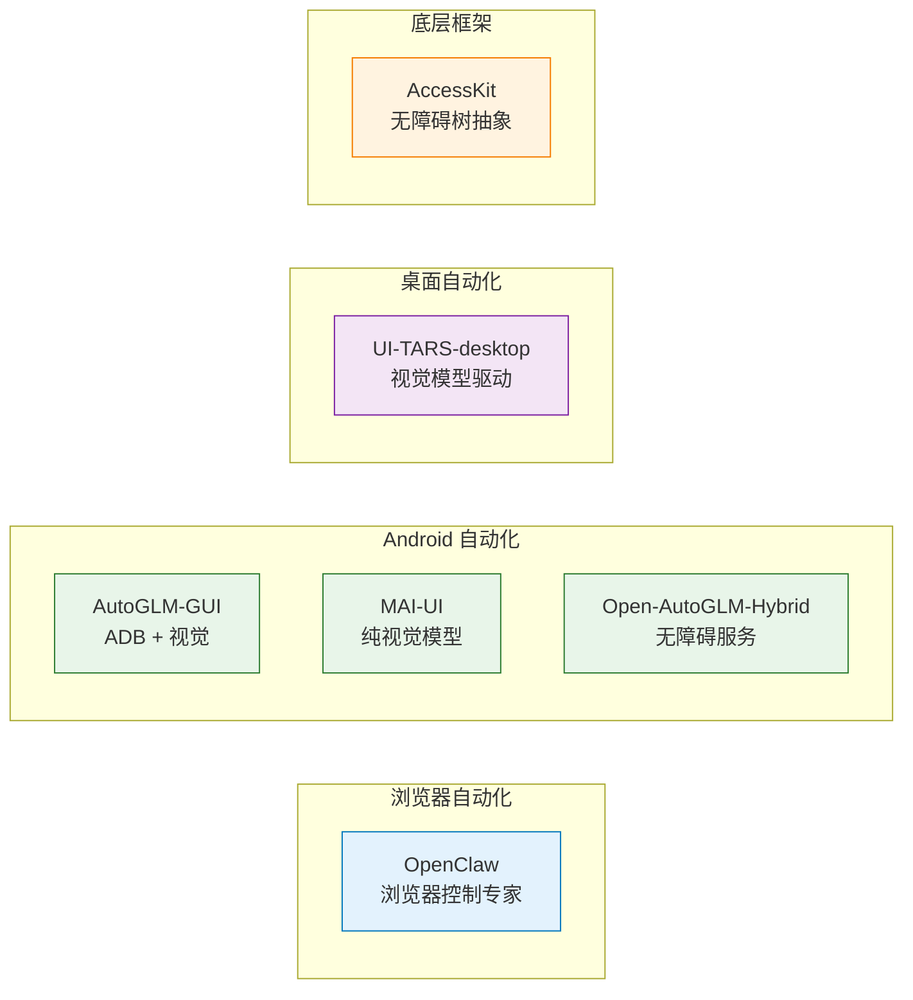
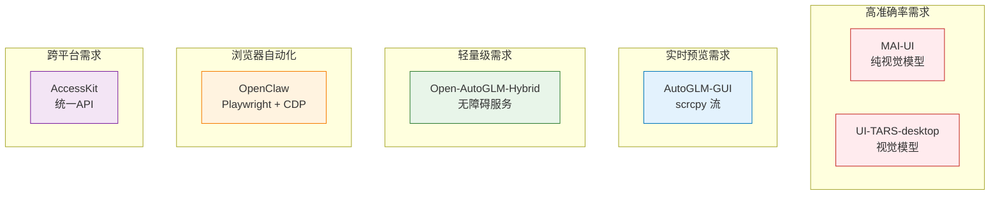
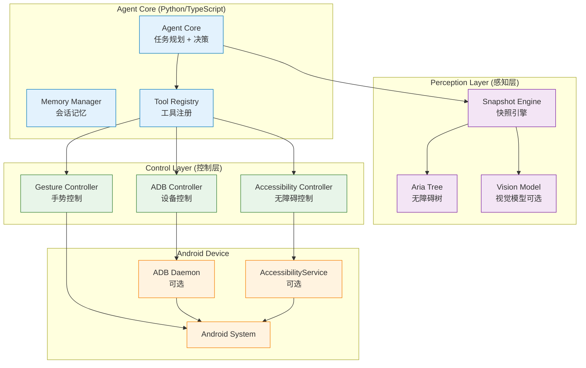

# Android GUI Agent 框架横向对比与架构推荐

> **目标**: 基于现有开源框架的深入分析，为开发 Android GUI Agent 提供架构设计建议

---

## 目录

1. [框架概览](#1-框架概览)
2. [技术架构对比](#2-技术架构对比)
3. [核心能力对比](#3-核心能力对比)
4. [适用场景分析](#4-适用场景分析)
5. [架构推荐方案](#5-架构推荐方案)
6. [实现路径](#6-实现路径)

---

## 1. 框架概览

### 1.1 框架列表

| 框架名称 | 主要技术栈 | 目标平台 | 开源状态 | 成熟度 |
|---------|-----------|---------|---------|--------|
| **OpenClaw** | TypeScript, Playwright, CDP | 浏览器 + 桌面 | ✅ 开源 | ⭐⭐⭐⭐⭐ |
| **AutoGLM-GUI** | Python, ADB, scrcpy | Android | ✅ 开源 | ⭐⭐⭐⭐ |
| **UI-TARS-desktop** | TypeScript, nut-js, UI-TARS模型 | 桌面 + 浏览器 | ✅ 开源 | ⭐⭐⭐⭐ |
| **MAI-UI** | Python, Vision Model | Android | ✅ 开源 | ⭐⭐⭐⭐⭐ |
| **Open-AutoGLM-Hybrid** | Python, AccessibilityService | Android | ✅ 开源 | ⭐⭐⭐ |
| **AccessKit** | Rust, 无障碍API | 跨平台 | ✅ 开源 | ⭐⭐⭐ |

### 1.2 框架定位



---

## 2. 技术架构对比

### 2.1 OpenClaw

**核心架构**:
```
Gateway (控制平面)
  ├── Browser Control (Playwright + CDP)
  ├── Canvas (A2UI 协议)
  └── Nodes (macOS/iOS/Android)
```

**技术特点**:
- ✅ **Playwright + CDP 双重能力**: 既使用 Playwright 高级 API，也直接调用 CDP
- ✅ **三种快照模式**: Aria/AI/Role Snapshot，适应不同场景
- ✅ **引用系统**: 基于语义的引用，比 CSS 选择器更稳定
- ✅ **多 Profile 隔离**: 支持多个浏览器配置文件
- ✅ **协议驱动**: 基于 WebSocket 和 ACP 协议

**适用场景**:
- 浏览器自动化（主要）
- 跨平台控制（桌面 + 移动端）
- 需要精细控制的场景

**Android 适配难度**: ⭐⭐⭐ (需要大量改造)

---

### 2.2 AutoGLM-GUI

**核心架构**:
```
Python Agent
  ├── ADB Controller (设备控制)
  ├── scrcpy (屏幕流)
  ├── Vision Model (GRS AI)
  └── HTTP Server (本地通信)
```

**技术特点**:
- ✅ **ADB 深度集成**: 通过 Android Debug Bridge 直接控制
- ✅ **实时屏幕预览**: 基于 scrcpy 的低延迟视频流
- ✅ **视觉模型驱动**: 使用 GRS AI 进行视觉理解
- ✅ **定时任务支持**: Cron 风格的任务调度
- ✅ **Docker 部署**: 支持 7x24 小时运行

**适用场景**:
- Android 设备自动化（主要）
- 需要实时屏幕预览的场景
- 服务器端部署

**Android 适配难度**: ⭐ (原生支持)

---

### 2.3 UI-TARS-desktop

**核心架构**:
```
GUIAgent SDK
  ├── UI-TARS Model (视觉模型)
  ├── Operator (nut-js / Browser / Mobile)
  └── Action Parser (动作解析)
```

**技术特点**:
- ✅ **模型驱动**: 基于 UI-TARS 视觉模型
- ✅ **跨平台 Operator**: 支持桌面、浏览器、移动端
- ✅ **SDK 化设计**: 易于集成到其他项目
- ✅ **MCP 协议支持**: 可集成到 Claude Desktop 等

**适用场景**:
- 桌面应用自动化
- 需要视觉模型能力的场景
- SDK 集成场景

**Android 适配难度**: ⭐⭐ (已有 Mobile Operator)

---

### 2.4 MAI-UI

**核心架构**:
```
MAI-UI Model (2B/8B/32B/235B)
  ├── Vision Encoder
  ├── Agent-User Interaction
  ├── Device-Cloud Collaboration
  └── Dynamic RL Scaling
```

**技术特点**:
- ✅ **纯视觉模型**: 端到端的 GUI Agent 模型
- ✅ **多尺寸变体**: 2B 到 235B，适应不同需求
- ✅ **设备-云端协作**: 动态选择执行位置
- ✅ **强化学习**: 大规模 RL 训练

**适用场景**:
- 需要最高准确率的场景
- 有 GPU 资源的场景
- 研究型项目

**Android 适配难度**: ⭐⭐⭐ (需要模型部署)

---

### 2.5 Open-AutoGLM-Hybrid

**核心架构**:
```
Termux (Python)
  ├── AutoGLM Helper (Android APP)
  │   └── AccessibilityService
  └── LADB (备用方案)
```

**技术特点**:
- ✅ **纯手机端运行**: 无需电脑
- ✅ **双模式支持**: 无障碍服务 + LADB 降级
- ✅ **轻量级**: 仅需 2MB 的 Android APP
- ✅ **智能降级**: 自动选择最佳控制方式

**适用场景**:
- 纯手机端自动化
- 无需电脑的场景
- 轻量级需求

**Android 适配难度**: ⭐ (原生支持)

---

### 2.6 AccessKit

**核心架构**:
```
AccessKit (Rust)
  ├── Platform Adapters (macOS/Windows/Linux/Android)
  └── Consumer API (无障碍树访问)
```

**技术特点**:
- ✅ **跨平台无障碍树**: 统一的 API 抽象
- ✅ **Rust 实现**: 高性能、内存安全
- ✅ **底层框架**: 可被其他框架使用

**适用场景**:
- 需要跨平台无障碍树访问
- 作为底层框架使用
- Rust 项目

**Android 适配难度**: ⭐⭐⭐ (需要 Rust 生态)

---

## 3. 核心能力对比

### 3.1 快照/感知能力

| 框架 | 快照方式 | 技术实现 | 优势 | 劣势 |
|-----|---------|---------|------|------|
| **OpenClaw** | Aria/AI/Role Snapshot | Playwright + CDP | 三种模式可选，精确控制 | 仅限浏览器 |
| **AutoGLM-GUI** | 屏幕截图 + VLM | scrcpy + GRS AI | 实时预览，视觉理解 | 需要视觉模型 |
| **UI-TARS-desktop** | 屏幕截图 + UI-TARS | nut-js screenshot | 模型驱动，高准确率 | 需要模型服务 |
| **MAI-UI** | 屏幕截图 + MAI-UI | 纯视觉模型 | 端到端，SOTA 性能 | 资源消耗大 |
| **Open-AutoGLM-Hybrid** | 屏幕截图 | AccessibilityService | 轻量级，无需模型 | 准确率较低 |
| **AccessKit** | 无障碍树 | 平台原生 API | 跨平台，标准化 | 需要应用支持 |

### 3.2 交互能力

| 框架 | 交互方式 | 技术实现 | 精度 | 稳定性 |
|-----|---------|---------|------|--------|
| **OpenClaw** | Playwright API | CDP 命令 | ⭐⭐⭐⭐⭐ | ⭐⭐⭐⭐⭐ |
| **AutoGLM-GUI** | ADB 命令 | `adb shell input` | ⭐⭐⭐⭐ | ⭐⭐⭐⭐ |
| **UI-TARS-desktop** | nut-js / Operator | 平台原生 API | ⭐⭐⭐⭐ | ⭐⭐⭐⭐ |
| **MAI-UI** | 平台原生 API | 通过 Operator | ⭐⭐⭐⭐ | ⭐⭐⭐⭐ |
| **Open-AutoGLM-Hybrid** | AccessibilityService | `dispatchGesture()` | ⭐⭐⭐ | ⭐⭐⭐⭐ |
| **AccessKit** | 无障碍动作 | 平台原生 API | ⭐⭐⭐⭐ | ⭐⭐⭐⭐⭐ |

### 3.3 架构设计

| 框架 | 架构模式 | 通信协议 | 扩展性 | 复杂度 |
|-----|---------|---------|--------|--------|
| **OpenClaw** | Gateway + Nodes | WebSocket + ACP | ⭐⭐⭐⭐⭐ | ⭐⭐⭐⭐ |
| **AutoGLM-GUI** | Client-Server | HTTP + ADB | ⭐⭐⭐ | ⭐⭐⭐ |
| **UI-TARS-desktop** | SDK + Operator | 函数调用 | ⭐⭐⭐⭐ | ⭐⭐⭐ |
| **MAI-UI** | Model + Operator | 函数调用 | ⭐⭐⭐ | ⭐⭐⭐⭐ |
| **Open-AutoGLM-Hybrid** | Termux + APP | HTTP (本地) | ⭐⭐ | ⭐⭐ |
| **AccessKit** | Library | 函数调用 | ⭐⭐⭐⭐ | ⭐⭐⭐ |

---

## 4. 适用场景分析

### 4.1 场景矩阵



### 4.2 选择建议

**场景 1: 需要最高准确率**
- **推荐**: MAI-UI 或 UI-TARS-desktop
- **理由**: 视觉模型驱动，准确率最高
- **代价**: 需要 GPU 资源和模型服务

**场景 2: 需要实时屏幕预览**
- **推荐**: AutoGLM-GUI
- **理由**: 基于 scrcpy 的低延迟视频流
- **代价**: 需要 ADB 连接

**场景 3: 纯手机端运行**
- **推荐**: Open-AutoGLM-Hybrid
- **理由**: 无需电脑，轻量级
- **代价**: 准确率相对较低

**场景 4: 浏览器自动化**
- **推荐**: OpenClaw
- **理由**: Playwright + CDP，功能最全
- **代价**: 仅限浏览器场景

**场景 5: 跨平台需求**
- **推荐**: AccessKit + 自定义 Agent
- **理由**: 统一的无障碍树 API
- **代价**: 需要自己实现 Agent 逻辑

---

## 5. 架构推荐方案

### 5.1 推荐架构：混合方案

基于对现有框架的分析，推荐采用**混合架构**，结合各框架的优势：



### 5.2 核心设计原则

**1. 多模式降级策略**

借鉴 Open-AutoGLM-Hybrid 的智能降级思路：

```python
class AndroidController:
    def __init__(self):
        self.modes = [
            ("accessibility", self.try_accessibility),
            ("adb", self.try_adb),
            ("uiautomator", self.try_uiautomator),
        ]
        self.current_mode = None
    
    def initialize(self):
        for mode_name, try_func in self.modes:
            if try_func():
                self.current_mode = mode_name
                return True
        raise Exception("No available control mode")
```

**2. 快照系统设计**

结合 OpenClaw 的多模式快照和 AutoGLM-GUI 的视觉理解：

```python
class SnapshotEngine:
    def snapshot(self, mode: str = "auto"):
        if mode == "aria" or (mode == "auto" and self.has_accessibility):
            return self.snapshot_aria()  # 无障碍树
        elif mode == "vision" or (mode == "auto" and self.has_vision_model):
            return self.snapshot_vision()  # 视觉模型
        else:
            return self.snapshot_screenshot()  # 纯截图
```

**3. 引用系统设计**

借鉴 OpenClaw 的引用系统，但适配 Android：

```python
class RefSystem:
    def __init__(self):
        self.ref_cache = {}  # target_id -> refs
    
    def generate_refs(self, snapshot):
        """生成稳定的引用ID"""
        refs = {}
        for idx, node in enumerate(snapshot.nodes):
            ref_id = f"e{idx}"
            refs[ref_id] = {
                "role": node.role,
                "name": node.name,
                "bounds": node.bounds,
            }
        return refs
    
    def resolve_ref(self, ref_id: str):
        """解析引用ID到实际元素"""
        ref_info = self.ref_cache.get(ref_id)
        if not ref_info:
            raise ValueError(f"Ref {ref_id} not found")
        
        # 根据模式选择定位方式
        if self.mode == "accessibility":
            return self.find_by_accessibility(ref_info)
        elif self.mode == "adb":
            return self.find_by_uiautomator(ref_info)
```

### 5.3 技术栈推荐

**核心语言**: Python 3.11+
- 生态丰富（ADB、图像处理、AI 模型）
- 易于集成现有框架

**设备控制**:
- **主要**: ADB (Android Debug Bridge)
- **备用**: AccessibilityService (无需 root)
- **高级**: UIAutomator2 (更强大的定位)

**快照系统**:
- **主要**: AccessibilityService.getRootInActiveWindow() (无障碍树)
- **备用**: ADB screencap (截图)
- **增强**: 视觉模型 (可选，提高准确率)

**通信协议**:
- **本地**: HTTP (类似 AutoGLM-GUI)
- **远程**: WebSocket (类似 OpenClaw)

**模型集成**:
- **可选**: UI-TARS 或 MAI-UI (提高准确率)
- **轻量**: 纯无障碍树 (无需模型)

### 5.4 架构分层设计

```
┌─────────────────────────────────────┐
│   Agent Layer (任务规划 + 决策)      │
│   - 理解用户意图                      │
│   - 制定执行计划                      │
│   - 调用工具                          │
└──────────────┬──────────────────────┘
               │
┌──────────────▼──────────────────────┐
│   Tool Layer (工具抽象层)            │
│   - Snapshot Tool                    │
│   - Click Tool                       │
│   - Type Tool                        │
│   - Swipe Tool                       │
└──────────────┬──────────────────────┘
               │
┌──────────────▼──────────────────────┐
│   Control Layer (控制实现层)         │
│   - ADB Controller                   │
│   - Accessibility Controller         │
│   - UIAutomator Controller           │
└──────────────┬──────────────────────┘
               │
┌──────────────▼──────────────────────┐
│   Android System                     │
└──────────────────────────────────────┘
```

---

## 6. 实现路径

### 6.1 阶段一：基础框架 (1-2周)

**目标**: 实现基本的设备控制和快照功能

**任务**:
1. ✅ ADB 连接和基础命令
2. ✅ 屏幕截图功能
3. ✅ 基础交互（点击、滑动、输入）
4. ✅ 简单的任务执行循环

**参考**: Open-AutoGLM-Hybrid 的基础实现

### 6.2 阶段二：快照系统 (1-2周)

**目标**: 实现多模式快照系统

**任务**:
1. ✅ AccessibilityService 集成
2. ✅ 无障碍树解析
3. ✅ 引用系统实现
4. ✅ 快照缓存机制

**参考**: OpenClaw 的快照系统设计

### 6.3 阶段三：智能降级 (1周)

**目标**: 实现多模式自动降级

**任务**:
1. ✅ 模式检测逻辑
2. ✅ 自动降级机制
3. ✅ 错误处理和重试

**参考**: Open-AutoGLM-Hybrid 的降级逻辑

### 6.4 阶段四：视觉增强 (可选, 2-3周)

**目标**: 集成视觉模型提高准确率

**任务**:
1. ✅ UI-TARS 或 MAI-UI 模型集成
2. ✅ 视觉定位功能
3. ✅ 混合快照（无障碍树 + 视觉）

**参考**: AutoGLM-GUI 和 UI-TARS-desktop 的模型集成

### 6.5 阶段五：高级功能 (可选, 2-3周)

**目标**: 添加高级功能

**任务**:
1. ✅ 实时屏幕预览（scrcpy）
2. ✅ 任务录制和回放
3. ✅ 多设备管理
4. ✅ Web 管理界面

**参考**: AutoGLM-GUI 的高级功能

---

## 7. 总结与建议

### 7.1 核心建议

1. **从简单开始**: 先实现 ADB + 无障碍树的混合方案
2. **渐进增强**: 后续可选择性添加视觉模型
3. **借鉴最佳实践**: 
   - OpenClaw 的引用系统和快照设计
   - AutoGLM-GUI 的实时预览和任务调度
   - Open-AutoGLM-Hybrid 的降级策略

### 7.2 技术选型总结

| 组件 | 推荐方案 | 理由 |
|-----|---------|------|
| **核心语言** | Python | 生态丰富，易于集成 |
| **设备控制** | ADB + AccessibilityService | 双重保障，自动降级 |
| **快照系统** | 无障碍树 + 可选视觉模型 | 平衡准确率和资源消耗 |
| **通信协议** | HTTP (本地) + WebSocket (远程) | 简单高效 |
| **架构模式** | Agent + Tools + Controllers | 清晰分层，易于扩展 |

### 7.3 预期效果

- **准确率**: 90-95% (无障碍树) 或 95-99% (加入视觉模型)
- **响应时间**: 2-5 秒/操作
- **资源消耗**: 低 (无障碍树) 或 中等 (视觉模型)
- **部署复杂度**: 中等 (需要 ADB 或无障碍权限)

---

**文档结束**
