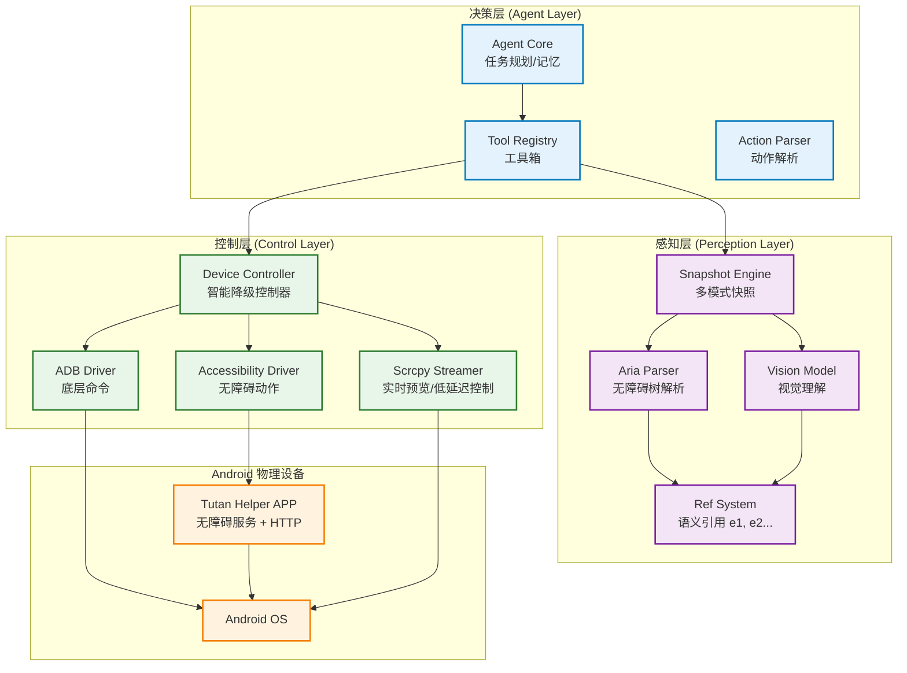

# TUTAN_AGENT 架构设计与实施方案

> **项目愿景**: 打造一个工业级、高稳定性、具备深度语义理解能力的 Android GUI Agent。
> **核心理念**: 以 AutoGLM-GUI 为工程底座，注入 OpenClaw 的语义引用灵魂，集成 MAI-UI 的视觉与 scrcpy 实时交互能力。

---

## 1. 整体架构设计

TUTAN_AGENT 采用**分层解耦、多模态感知、智能降级控制**的架构。

### 1.1 架构拓扑图

---

## 2. 核心技术方案

### 2.1 语义引用系统 (Ref System) —— 借鉴 OpenClaw
不同于传统的坐标点击，TUTAN_AGENT 优先使用**语义引用**。

- **原理**: 每次快照生成时，为无障碍树中的每个交互节点分配一个唯一 ID（如 `e1`, `e2`）。
- **优势**: 
    - **稳定性**: 即使 UI 发生微小位移，只要节点属性不变，ID 依然有效。
    - **LLM 友好**: LLM 处理 `click(e5)` 的逻辑远比处理 `click(450, 890)` 稳健。
    - **低带宽**: 传输结构化 JSON 远比传输大图快。

### 2.2 实时交互与预览 (Scrcpy) —— 借鉴 MAI-UI-WebUI
集成 `scrcpy` 解决 AutoGLM 原生连接难用、反馈慢的问题。

- **集成方案**: 
    - 内置 `scrcpy-server` 及其二进制客户端。
    - 提供**低延迟视频流**，用户可在 Web 界面实时看到 Agent 的每一步操作。
    - **反向控制**: 支持在 Web 预览界面直接手动点击/滑动，Agent 自动同步状态。

### 2.3 智能降级控制 (Hybrid Control)
解决 ADB 权限受限或无障碍服务失效的问题。

1.  **Level 1: 无障碍服务 (推荐)**: 速度最快，支持获取完整无障碍树，支持手势模拟。
2.  **Level 2: ADB 命令 (备用)**: 当无障碍服务不可用时，通过 `adb shell input` 执行操作。
3.  **Level 3: 视觉模型 (兜底)**: 针对游戏、Flutter 等无法获取无障碍树的场景，调用 VLM 进行视觉定位。

---

## 3. 解决 ADB 连接难用的专项方案

针对 AutoGLM-GUI 当前连接不稳定的问题，TUTAN_AGENT 实施以下优化：

### 3.1 增强型 ADB 探测机制
- **多路径搜索**: 自动搜索系统 PATH、项目内置目录、Android SDK 目录。
- **状态轮询优化**: 引入 `DeviceCache`（TTL 机制），避免频繁调用 `adb devices` 导致的进程阻塞。
- **自动重启服务**: 检测到 ADB 挂起时，自动执行 `kill-server` & `start-server`。

### 3.2 无线连接一键化
- **USB 转无线**: 只要插上数据线点击一次，自动执行 `adb tcpip 5555` 并获取 IP 进行连接。
- **mDNS 自动发现**: 自动扫描局域网内开启了无线调试的 Android 11+ 设备。

### 3.3 连接诊断工具 (借鉴 MAI-UI)
- 提供专门的 `ADB 链路测试` 页面。
- 实时显示：`物理连接 -> 授权状态 -> TCP/IP 开启 -> 无障碍服务激活` 的完整链路状态。

---

## 4. 实施计划 (Roadmap)

### 第一阶段：工程底座搭建 (Week 1-2)
- [x] 搭建 Python 后端框架 (FastAPI + Socket.IO)。
- [x] 集成 `scrcpy` 核心组件，实现 Web 端实时画面流。
- [x] 实现增强型 ADB 连接管理器，解决“连不上”的痛点。

### 第二阶段：感知系统升级 (Week 3-4)
- [x] 开发 `TutanHelper` Android APP (无障碍服务)。
- [x] 实现 **Aria Tree** 解析器，将 Android 节点转换为 OpenClaw 风格的 JSON。
- [x] 实现 **Ref System**，完成 `e1`, `e2` 引用 ID 的生成与解析。

### 第三阶段：Agent 逻辑集成 (Week 5-6)
- [x] 集成 LLM 接口，支持 GLM-4V / Claude 3.5 Vision。
- [x] 编写支持 Ref 系统的 System Prompt。
- [x] 实现任务规划与执行的闭环流。

---

## 5. 总结

TUTAN_AGENT 不仅仅是代码的堆砌，而是**工程化思维**的产物。它通过 `scrcpy` 解决了交互体验，通过 `Ref System` 解决了逻辑稳定性，通过 `智能降级` 解决了环境兼容性。

> **下一步行动**: 建议先从 `GUI_AGENT/TUTAN_AGENT/android-app` 开始开发无障碍服务助手。
