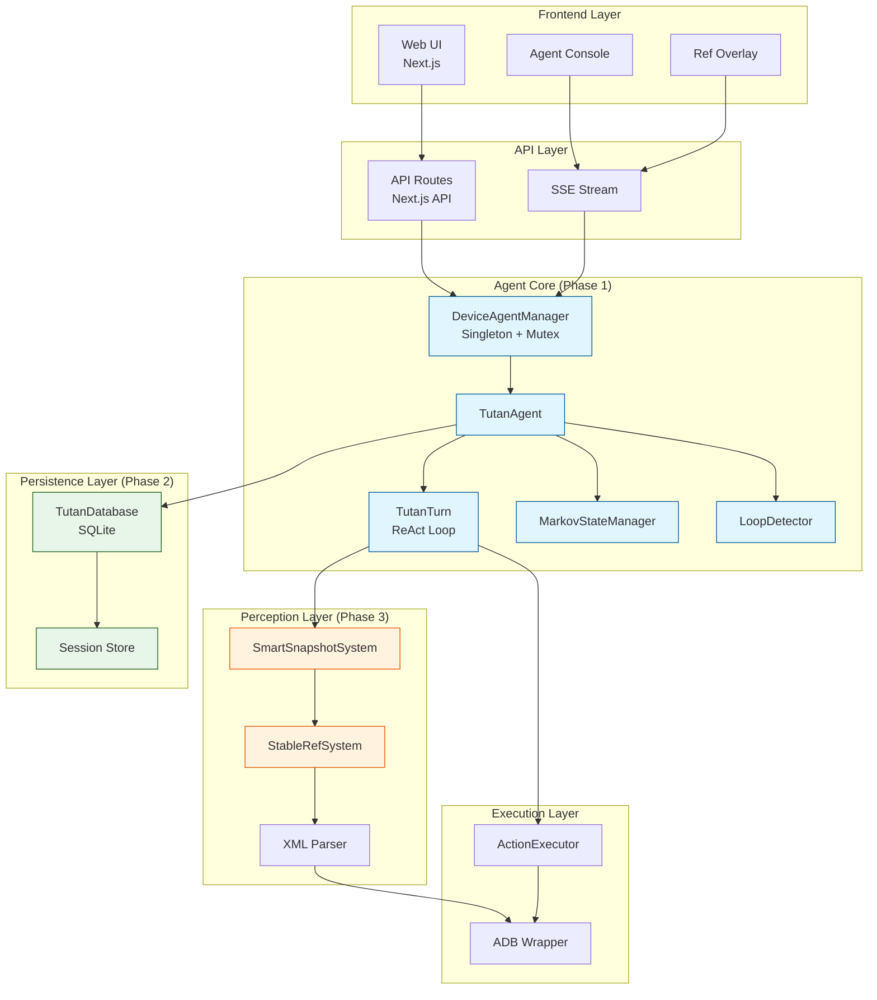

# TUTAN_AGENT 演进与改进分析报告 (2026)

> **目标**: 参考 `smart_agent`、`AutoGLM-GUI`、`OpenClaw` 等项目，分析 `TUTAN_AGENT` 的改进空间，制定分阶段演进路线图。  
> **核心范式**: 引入 **Agentic ReAct** 架构，对标 `AutoGLM-GUI` 的工程形态，集成 `smart_agent` 的马尔可夫性设计。  
> **产品定位**: 类似 AutoGLM-GUI 的 Android GUI 自动化工具，但具备更强的 Agentic 推理能力。

---

## 目录

1. [当前实现深度分析](#1-当前实现深度分析)
2. [Agentic ReAct 范式深度引入](#2-agentic-react-范式深度引入)
3. [OpenClaw 技术借鉴深度分析](#3-openclaw-技术借鉴深度分析)
4. [AutoGLM-GUI 工程形态对标](#4-autoglm-gui-工程形态对标)
5. [详细演进路线图 (Phases)](#5-详细演进路线图-phases)
6. [Bug 清单与风险分析](#6-bug-清单与风险分析)
7. [技术选型与实现细节](#7-技术选型与实现细节)
8. [总结与优先级排序](#8-总结与优先级排序)

---

## 1. 当前实现深度分析

### 1.1 代码架构现状

**当前 `TutanAgent` 实现** (`backend/tutan_agent_nextjs/src/lib/agent.ts`):

```typescript
export class TutanAgent {
  private history: any[] = [];  // ❌ 问题1: 全量历史推入上下文
  private isRunning: boolean = false;
  private maxSteps: number = 20;

  async *runTask(task: string): AsyncGenerator<AgentEvent> {
    while (this.isRunning && stepCount < this.maxSteps) {
      // 1. Perception: 每次重新 Dump XML
      const xml = await ADB.dumpHierarchy(this.serial);
      const uiContext = this.refSystem.parseXmlDump(xml);
      
      // 2. Planning: 直接调用 LLM，传入全量 history
      const plan = await this.planner.planNextStep(task, uiContext, this.history);
      
      // 3. Execution: 执行动作
      const success = await this.executor.execute(plan.action, plan.params);
      
      // 4. Update History: 简单追加，无压缩
      this.history.push({ role: 'assistant', content: JSON.stringify(plan) });
      this.history.push({ role: 'user', content: `Action result: ${success}` });
    }
  }
}
```

**核心问题诊断**:

| 问题类别 | 具体问题 | 影响 | 严重程度 |
|---------|---------|------|---------|
| **上下文管理** | `history` 数组无限增长，每次调用 LLM 都传入全量历史 | Token 成本爆炸，长任务后期推理质量下降 | ⭐⭐⭐⭐⭐ |
| **推理透明度** | 只有 `thinking` 字段，缺乏完整的 ReAct 循环 | 无法追踪 Agent 的决策过程，调试困难 | ⭐⭐⭐⭐ |
| **状态管理** | 无状态压缩机制，Agent 无法"忘记"无关历史 | 容易受早期错误干扰，无法专注当前屏幕 | ⭐⭐⭐⭐⭐ |
| **循环检测** | 无死循环检测，Agent 可能反复点击无效按钮 | 浪费 Token 和 API 调用，任务卡死 | ⭐⭐⭐⭐ |
| **并发控制** | 无设备级锁，多任务可能同时操作同一设备 | ADB 指令冲突，设备状态混乱 | ⭐⭐⭐⭐⭐ |
| **持久化** | 所有状态在内存中，服务重启即丢失 | 无法恢复任务，无法审计历史 | ⭐⭐⭐⭐ |

### 1.2 Planner 层问题分析

**当前 `TutanPlanner` 实现** (`backend/tutan_agent_nextjs/src/lib/planner.ts`):

```typescript
async planNextStep(task: string, uiContext: string, history: any[], clientConfig?: any) {
  const messages = [
    { role: 'system', content: this.getSystemPrompt() },
    ...history,  // ❌ 全量历史，无压缩
    { role: 'user', content: prompt }
  ];
  
  // ❌ 问题: 无 ReAct 范式强制，LLM 可能直接输出 action，无思考过程
  const response = await axios.post(`${this.baseUrl}/chat/completions`, {
    model: this.model,
    messages: messages,
    response_format: { type: 'json_object' },
    temperature: 1  // ❌ 温度过高，可能导致不稳定
  });
}
```

**System Prompt 问题**:
- ❌ 缺乏显式的 ReAct 格式要求（Observation -> Thought -> Action -> Reflection）
- ❌ 无马尔可夫性提示，LLM 不知道应该"只看当前状态"
- ❌ 无循环检测提示，LLM 可能陷入重复动作

### 1.3 Ref System 问题分析

**当前 `RefSystem` 实现** (`backend/tutan_agent_nextjs/src/lib/ref-system.ts`):

```typescript
parseAriaTree(tree: AriaNode): string {
  this.reset();  // ❌ 每次重置，Ref ID 不稳定
  const flattened: RefNode[] = [];
  this.traverse(tree, flattened);
  
  // ❌ 问题: Ref ID 基于遍历顺序，页面小变化会导致 ID 变化
  this.refCounter++;
  const refId = `e${this.refCounter}`;
}
```

**问题**:
- ❌ Ref ID 不稳定：页面滚动或局部刷新后，同一个按钮的 ID 可能从 `e5` 变成 `e8`
- ❌ 无缓存机制：每次重新解析，无法识别"这是之前见过的元素"
- ❌ 过滤逻辑简单：只过滤 `clickable` 和 `editable`，但 Android 中大量 `FrameLayout` 仍会被包含

---

## 2. Agentic ReAct 范式深度引入

本章节详细阐述如何将 `smart_agent` 的 ReAct 架构移植到 `TutanAgent`。

### 2.1 ReAct 核心循环设计

**参考 `smart_agent` 的 `Turn` 类设计** (`ai-glass-car-control/smart_agent/lib/core/turn.ts`):

`smart_agent` 的核心是 **Turn 类**，它管理单次 ReAct 循环的完整生命周期：

```typescript
// smart_agent 的 Turn 类核心结构
export class Turn {
  readonly pendingToolCalls: FunctionCall[] = [];
  finishReason: FinishReason | undefined = undefined;
  
  async *run(
    sendMessageStream: Function,
    request: any,
    signal: AbortSignal,
    turns: number
  ): AsyncGenerator<ServerGeminiStreamEvent> {
    // 1. 初始化推理
    // 2. 流式调用 LLM
    // 3. 解析工具调用
    // 4. 执行工具
    // 5. 观察结果
    // 6. 继续循环或结束
  }
}
```

**TutanAgent 的 ReAct 循环设计**:

```typescript
// 新的 Turn 类设计（针对 GUI Agent）
export class TutanTurn {
  private observation: string = '';      // 当前屏幕状态
  private thought: string = '';           // 思考过程
  private action: Action | null = null;    // 计划执行的动作
  private reflection: string = '';        // 执行后的反思
  
  async *execute(
    deviceSerial: string,
    task: string,
    previousSummary: string  // 马尔可夫压缩后的历史摘要
  ): AsyncGenerator<TurnEvent> {
    // Step 1: Observation (观察)
    yield { type: 'observation', data: { phase: 'observing' } };
    const uiContext = await this.observeScreen(deviceSerial);
    this.observation = uiContext;
    
    // Step 2: Thought (思考)
    yield { type: 'thought', data: { phase: 'thinking' } };
    const reasoning = await this.think(task, uiContext, previousSummary);
    this.thought = reasoning.thought;
    this.action = reasoning.action;
    
    // Step 3: Action (行动)
    if (this.action) {
      yield { type: 'action', data: { action: this.action } };
      const result = await this.executeAction(deviceSerial, this.action);
      
      // Step 4: Reflection (反思)
      yield { type: 'reflection', data: { phase: 'reflecting' } };
      this.reflection = await this.reflect(result, this.action);
    }
    
    // 返回完整的 Turn 结果
    return {
      observation: this.observation,
      thought: this.thought,
      action: this.action,
      reflection: this.reflection,
      summary: this.compressToMarkovState()  // 压缩为马尔可夫状态
    };
  }
}
```

### 2.2 马尔可夫状态管理 (Markov State Management)

**核心思想**: Agent 的决策应该只依赖"当前状态"，而非完整历史。这符合马尔可夫性质：`P(未来状态 | 当前状态, 历史) = P(未来状态 | 当前状态)`。

**实现设计**:

```typescript
// 马尔可夫状态管理器
export class MarkovStateManager {
  /**
   * 将完整的 ReAct 历史压缩为马尔可夫状态
   * 只保留: 当前屏幕特征 + 任务进度摘要
   */
  compressToMarkovState(turns: TutanTurn[]): MarkovState {
    if (turns.length === 0) {
      return { currentScreen: '', progress: '任务开始' };
    }
    
    const lastTurn = turns[turns.length - 1];
    const progress = this.summarizeProgress(turns);
    
    return {
      // 当前屏幕的语义特征（而非完整 UI 树）
      currentScreen: this.extractScreenFeatures(lastTurn.observation),
      // 任务进度摘要（一句话概括已完成的操作）
      progress: progress,
      // 关键里程碑（如"已登录"、"已进入搜索页"）
      milestones: this.extractMilestones(turns)
    };
  }
  
  /**
   * 将过去 N 步的操作压缩为一句话
   * 例如: "已完成登录，当前正在搜索框输入关键词"
   */
  private summarizeProgress(turns: TutanTurn[]): string {
    const recentTurns = turns.slice(-5);  // 只看最近 5 步
    const actions = recentTurns.map(t => t.action?.type).filter(Boolean);
    
    // 使用 LLM 或规则引擎压缩
    if (actions.includes('finish')) {
      return '任务已完成';
    }
    if (actions.includes('click') && actions.includes('type')) {
      return '正在输入信息';
    }
    // ... 更多规则
    
    return `已执行 ${actions.length} 步操作`;
  }
  
  /**
   * 提取屏幕的关键特征（而非完整描述）
   * 例如: "登录页面，包含账号输入框和密码输入框"
   */
  private extractScreenFeatures(observation: string): string {
    // 使用简单的关键词提取或 LLM 摘要
    const lines = observation.split('\n');
    const interactiveElements = lines.filter(l => 
      l.includes('[clickable]') || l.includes('[editable]')
    );
    
    // 提取关键元素类型
    const buttons = interactiveElements.filter(l => l.includes('Button')).length;
    const inputs = interactiveElements.filter(l => l.includes('EditText')).length;
    
    return `屏幕包含 ${buttons} 个按钮，${inputs} 个输入框`;
  }
}
```

**在 Agent 中的使用**:

```typescript
export class TutanAgent {
  private markovManager = new MarkovStateManager();
  private turns: TutanTurn[] = [];
  
  async *runTask(task: string): AsyncGenerator<AgentEvent> {
    while (this.isRunning) {
      // 1. 获取马尔可夫状态（而非全量历史）
      const markovState = this.markovManager.compressToMarkovState(this.turns);
      
      // 2. 执行新的 Turn
      const turn = new TutanTurn();
      const turnResult = await turn.execute(this.serial, task, markovState.progress);
      
      // 3. 保存 Turn（但下次循环时只使用压缩后的状态）
      this.turns.push(turnResult);
      
      // 4. 检查是否完成
      if (turnResult.action?.type === 'finish') {
        break;
      }
    }
  }
}
```

### 2.3 循环检测器 (Loop Detection)

**实现设计**:

```typescript
export class LoopDetector {
  private actionHistory: Array<{ action: string; params: any; timestamp: number }> = [];
  private readonly MAX_REPEAT_COUNT = 3;
  private readonly TIME_WINDOW_MS = 30000;  // 30秒内的重复才算循环
  
  /**
   * 检测是否陷入死循环
   */
  detectLoop(action: Action): LoopDetectionResult {
    const now = Date.now();
    
    // 清理过期记录
    this.actionHistory = this.actionHistory.filter(
      a => now - a.timestamp < this.TIME_WINDOW_MS
    );
    
    // 检查最近是否有重复动作
    const recentSameActions = this.actionHistory.filter(a => 
      a.action === action.type &&
      JSON.stringify(a.params) === JSON.stringify(action.params)
    );
    
    if (recentSameActions.length >= this.MAX_REPEAT_COUNT) {
      return {
        isLoop: true,
        repeatedCount: recentSameActions.length,
        suggestion: this.generateSuggestion(action)
      };
    }
    
    // 记录当前动作
    this.actionHistory.push({
      action: action.type,
      params: action.params,
      timestamp: now
    });
    
    return { isLoop: false };
  }
  
  private generateSuggestion(action: Action): string {
    if (action.type === 'click') {
      return '检测到重复点击同一元素，建议：1) 检查元素是否真的可点击 2) 尝试滑动页面 3) 检查是否在正确的页面';
    }
    // ... 更多建议
    return '检测到重复动作，建议尝试其他操作路径';
  }
}
```

**集成到 Agent**:

```typescript
export class TutanAgent {
  private loopDetector = new LoopDetector();
  
  async *runTask(task: string): AsyncGenerator<AgentEvent> {
    while (this.isRunning) {
      const turn = new TutanTurn();
      const action = await turn.think(...);
      
      // 循环检测
      const loopResult = this.loopDetector.detectLoop(action);
      if (loopResult.isLoop) {
        yield {
          type: 'warning',
          data: {
            message: `检测到死循环: ${loopResult.suggestion}`,
            action: action
          }
        };
        
        // 强制 Agent 反思
        const reflection = await this.forceReflection(loopResult);
        if (reflection.shouldAbort) {
          yield { type: 'error', data: { message: '任务因死循环中止' } };
          break;
        }
      }
      
      await turn.execute(...);
    }
  }
}
```

### 2.4 推理链可视化 (Reasoning Chain Visualization)

**前端组件设计**:

```typescript
// components/ReasoningChain.tsx
export const ReasoningChain: React.FC<{ turns: TutanTurn[] }> = ({ turns }) => {
  return (
    <div className="reasoning-chain">
      {turns.map((turn, idx) => (
        <div key={idx} className="turn-card">
          <div className="phase observation">
            <h4>观察 (Observation)</h4>
            <pre>{turn.observation}</pre>
          </div>
          
          <div className="phase thought">
            <h4>思考 (Thought)</h4>
            <p>{turn.thought}</p>
          </div>
          
          <div className="phase action">
            <h4>行动 (Action)</h4>
            <code>{JSON.stringify(turn.action, null, 2)}</code>
          </div>
          
          <div className="phase reflection">
            <h4>反思 (Reflection)</h4>
            <p>{turn.reflection}</p>
          </div>
        </div>
      ))}
    </div>
  );
};
```

---

## 3. OpenClaw 技术借鉴深度分析

### 3.1 快照系统 (Snapshot System) 的借鉴

**OpenClaw 的三种快照模式**:

1. **Aria Snapshot**: 直接调用 CDP 的 `Accessibility.getFullAXTree`
2. **AI Snapshot**: Playwright 的 `_snapshotForAI`，智能过滤和合并
3. **Role Snapshot**: 结合两者优势，生成结构化描述

**TutanAgent 的改进方案**:

```typescript
// 新的智能快照系统
export class SmartSnapshotSystem {
  /**
   * 生成 AI 友好型快照（参考 OpenClaw）
   * 过滤掉 Android 中无意义的容器节点
   */
  generateAIFriendlySnapshot(xml: string): AISnapshot {
    const tree = XMLParser.parse(xml);
    const filtered = this.filterMeaningfulNodes(tree);
    const merged = this.mergeSimilarNodes(filtered);
    
    return {
      snapshot: this.formatForLLM(merged),
      refs: this.generateStableRefs(merged),
      stats: {
        totalNodes: tree.children.length,
        filteredNodes: filtered.length,
        finalNodes: merged.length
      }
    };
  }
  
  /**
   * 过滤规则（参考 OpenClaw 的智能过滤）
   */
  private filterMeaningfulNodes(node: AriaNode): AriaNode[] {
    const result: AriaNode[] = [];
    
    // 规则1: 保留所有可交互元素
    if (node.clickable || node.editable) {
      result.push(node);
    }
    
    // 规则2: 保留有文本内容的元素
    if (node.text || node.contentDescription) {
      result.push(node);
    }
    
    // 规则3: 过滤掉纯容器（如 FrameLayout、LinearLayout）
    // 除非它们有特殊属性（如 id、contentDescription）
    if (this.isPureContainer(node) && !node.id && !node.contentDescription) {
      // 不添加到结果，但继续遍历子节点
    } else {
      result.push(node);
    }
    
    // 递归处理子节点
    if (node.children) {
      for (const child of node.children) {
        result.push(...this.filterMeaningfulNodes(child));
      }
    }
    
    return result;
  }
  
  /**
   * 合并相似的节点（如多个相同的按钮）
   */
  private mergeSimilarNodes(nodes: AriaNode[]): AriaNode[] {
    // 实现逻辑：如果多个节点有相同的 role、text、bounds，
    // 可以合并为一个，并标注数量
    // ...
  }
}
```

### 3.2 引用系统 (Ref System) 的稳定性改进

**问题**: 当前 Ref ID 基于遍历顺序，页面变化后 ID 会改变。

**解决方案**: 基于元素特征生成稳定的哈希 ID。

```typescript
export class StableRefSystem {
  private refCache = new Map<string, string>();  // 特征哈希 -> Ref ID
  
  /**
   * 生成稳定的 Ref ID
   * 基于: Resource-ID + Text + Class + Bounds (相对位置)
   */
  generateStableRef(node: AriaNode, parentContext?: string): string {
    // 1. 计算特征哈希
    const features = {
      id: node.id || '',
      text: node.text || '',
      contentDesc: node.contentDescription || '',
      class: node.class,
      // 使用相对位置而非绝对位置（应对屏幕旋转）
      relativeBounds: this.calculateRelativeBounds(node.bounds)
    };
    
    const hash = this.hashFeatures(features);
    
    // 2. 检查缓存
    if (this.refCache.has(hash)) {
      return this.refCache.get(hash)!;
    }
    
    // 3. 生成新 Ref ID
    const refId = `e${this.refCache.size + 1}`;
    this.refCache.set(hash, refId);
    
    return refId;
  }
  
  /**
   * 计算相对位置（相对于父容器）
   */
  private calculateRelativeBounds(bounds: Bounds, parentBounds?: Bounds): RelativeBounds {
    if (!parentBounds) {
      return { x: 0, y: 0, width: bounds.right - bounds.left, height: bounds.bottom - bounds.top };
    }
    
    return {
      x: (bounds.left - parentBounds.left) / (parentBounds.right - parentBounds.left),
      y: (bounds.top - parentBounds.top) / (parentBounds.bottom - parentBounds.top),
      width: (bounds.right - bounds.left) / (parentBounds.right - parentBounds.left),
      height: (bounds.bottom - bounds.top) / (parentBounds.bottom - parentBounds.top)
    };
  }
  
  /**
   * 特征哈希算法
   */
  private hashFeatures(features: any): string {
    const str = JSON.stringify(features);
    // 使用简单的哈希算法（如 djb2）
    let hash = 5381;
    for (let i = 0; i < str.length; i++) {
      hash = ((hash << 5) + hash) + str.charCodeAt(i);
    }
    return hash.toString(36);
  }
  
  /**
   * 页面刷新后，尝试匹配旧的 Ref ID
   */
  matchRefs(newTree: AriaNode, oldRefs: Map<string, AriaNode>): Map<string, string> {
    const mapping = new Map<string, string>();  // 旧 Ref -> 新 Ref
    
    // 遍历新树，尝试匹配旧 Ref
    this.traverseAndMatch(newTree, oldRefs, mapping);
    
    return mapping;
  }
}
```

### 3.3 执行审批机制 (Execution Approval)

**参考 OpenClaw 的安全机制**:

```typescript
export class ActionApprovalManager {
  private readonly RISKY_ACTIONS = ['delete', 'send_message', 'payment', 'uninstall'];
  
  /**
   * 检查动作是否需要审批
   */
  requiresApproval(action: Action): boolean {
    return this.RISKY_ACTIONS.includes(action.type);
  }
  
  /**
   * 请求用户审批
   */
  async requestApproval(action: Action, context: string): Promise<ApprovalResult> {
    // 通过 Socket.IO 发送审批请求到前端
    const approvalEvent = {
      type: 'action_approval_required',
      action: action,
      context: context,
      timestamp: Date.now()
    };
    
    // 等待前端响应（通过 WebSocket）
    return new Promise((resolve) => {
      this.pendingApprovals.set(action.id, resolve);
      
      // 超时处理
      setTimeout(() => {
        if (this.pendingApprovals.has(action.id)) {
          this.pendingApprovals.delete(action.id);
          resolve({ approved: false, reason: '审批超时' });
        }
      }, 30000);  // 30秒超时
    });
  }
}

// 在 Agent 中集成
export class TutanAgent {
  private approvalManager = new ActionApprovalManager();
  
  async *runTask(task: string): AsyncGenerator<AgentEvent> {
    const action = await turn.think(...);
    
    // 检查是否需要审批
    if (this.approvalManager.requiresApproval(action)) {
      yield {
        type: 'approval_required',
        data: {
          action: action,
          message: `Agent 请求执行高危操作: ${action.type}`
        }
      };
      
      const approval = await this.approvalManager.requestApproval(action, turn.thought);
      if (!approval.approved) {
        yield {
          type: 'action_denied',
          data: { reason: approval.reason }
        };
        
        // 反馈给 LLM，让它尝试其他路径
        await turn.reflect({ denied: true, reason: approval.reason });
        continue;
      }
    }
    
    await turn.execute(action);
  }
}
```

---

## 4. AutoGLM-GUI 工程形态对标

### 4.1 设备代理管理器 (DeviceAgentManager)

**参考 AutoGLM-GUI 的 `PhoneAgentManager`**:

```typescript
// AutoGLM-GUI 的设计模式
class PhoneAgentManager {
  private static _instance: PhoneAgentManager;
  private agents: Map<string, Agent> = new Map();
  private locks: Map<string, Mutex> = new Map();
  
  @contextmanager
  use_agent(device_id: string) {
    const lock = this.getLock(device_id);
    await lock.acquire();
    try {
      const agent = this.getOrCreateAgent(device_id);
      yield agent;
    } finally {
      lock.release();
    }
  }
}
```

**TutanAgent 的实现**:

```typescript
import { Mutex } from 'async-mutex';

export class DeviceAgentManager {
  private static instance: DeviceAgentManager;
  private agents: Map<string, TutanAgent> = new Map();
  private locks: Map<string, Mutex> = new Map();
  private agentStates: Map<string, AgentState> = new Map();
  
  static getInstance(): DeviceAgentManager {
    if (!DeviceAgentManager.instance) {
      DeviceAgentManager.instance = new DeviceAgentManager();
    }
    return DeviceAgentManager.instance;
  }
  
  /**
   * 使用设备 Agent（自动加锁）
   */
  async useAgent<T>(
    deviceSerial: string,
    callback: (agent: TutanAgent) => Promise<T>
  ): Promise<T> {
    const lock = this.getLock(deviceSerial);
    
    try {
      await lock.acquire();
      
      // 检查 Agent 状态
      const state = this.agentStates.get(deviceSerial);
      if (state === 'BUSY') {
        throw new Error(`Device ${deviceSerial} is currently busy`);
      }
      
      // 获取或创建 Agent
      const agent = this.getOrCreateAgent(deviceSerial);
      
      // 更新状态
      this.agentStates.set(deviceSerial, 'BUSY');
      
      try {
        const result = await callback(agent);
        return result;
      } finally {
        this.agentStates.set(deviceSerial, 'IDLE');
      }
    } finally {
      lock.release();
    }
  }
  
  private getLock(deviceSerial: string): Mutex {
    if (!this.locks.has(deviceSerial)) {
      this.locks.set(deviceSerial, new Mutex());
    }
    return this.locks.get(deviceSerial)!;
  }
  
  private getOrCreateAgent(deviceSerial: string): TutanAgent {
    if (!this.agents.has(deviceSerial)) {
      this.agents.set(deviceSerial, new TutanAgent(deviceSerial));
    }
    return this.agents.get(deviceSerial)!;
  }
  
  /**
   * 获取 Agent 状态
   */
  getAgentState(deviceSerial: string): AgentState {
    return this.agentStates.get(deviceSerial) || 'IDLE';
  }
  
  /**
   * 销毁 Agent
   */
  destroyAgent(deviceSerial: string): void {
    const agent = this.agents.get(deviceSerial);
    if (agent) {
      agent.abort();
      this.agents.delete(deviceSerial);
      this.locks.delete(deviceSerial);
      this.agentStates.delete(deviceSerial);
    }
  }
}
```

**在 API 路由中使用**:

```typescript
// app/api/agents/run/route.ts
import { DeviceAgentManager } from '@/lib/device-agent-manager';

export async function POST(request: Request) {
  const { deviceSerial, task } = await request.json();
  const manager = DeviceAgentManager.getInstance();
  
  const stream = new ReadableStream({
    async start(controller) {
      await manager.useAgent(deviceSerial, async (agent) => {
        for await (const event of agent.runTask(task)) {
          controller.enqueue(
            `data: ${JSON.stringify(event)}\n\n`
          );
        }
        controller.close();
      });
    }
  });
  
  return new Response(stream, {
    headers: { 'Content-Type': 'text/event-stream' }
  });
}
```

### 4.2 SQLite 持久化层

**数据库 Schema 设计**:

```typescript
// lib/db/schema.ts
import Database from 'better-sqlite3';

export class TutanDatabase {
  private db: Database.Database;
  
  constructor(dbPath: string = './tutan.db') {
    this.db = new Database(dbPath);
    this.initSchema();
  }
  
  private initSchema() {
    // 会话表
    this.db.exec(`
      CREATE TABLE IF NOT EXISTS sessions (
        id TEXT PRIMARY KEY,
        device_serial TEXT NOT NULL,
        task TEXT NOT NULL,
        status TEXT NOT NULL,
        created_at INTEGER NOT NULL,
        updated_at INTEGER NOT NULL
      )
    `);
    
    // 任务历史表
    this.db.exec(`
      CREATE TABLE IF NOT EXISTS task_history (
        id TEXT PRIMARY KEY,
        session_id TEXT NOT NULL,
        turn_index INTEGER NOT NULL,
        observation TEXT,
        thought TEXT,
        action TEXT,
        reflection TEXT,
        markov_summary TEXT,
        timestamp INTEGER NOT NULL,
        FOREIGN KEY (session_id) REFERENCES sessions(id)
      )
    `);
    
    // 动作日志表
    this.db.exec(`
      CREATE TABLE IF NOT EXISTS action_logs (
        id TEXT PRIMARY KEY,
        session_id TEXT NOT NULL,
        action_type TEXT NOT NULL,
        action_params TEXT,
        success BOOLEAN,
        error_message TEXT,
        timestamp INTEGER NOT NULL,
        FOREIGN KEY (session_id) REFERENCES sessions(id)
      )
    `);
  }
  
  /**
   * 保存会话
   */
  saveSession(session: Session): void {
    const stmt = this.db.prepare(`
      INSERT OR REPLACE INTO sessions (id, device_serial, task, status, created_at, updated_at)
      VALUES (?, ?, ?, ?, ?, ?)
    `);
    
    stmt.run(
      session.id,
      session.deviceSerial,
      session.task,
      session.status,
      session.createdAt,
      session.updatedAt
    );
  }
  
  /**
   * 保存 Turn 历史
   */
  saveTurn(sessionId: string, turn: TutanTurn, turnIndex: number): void {
    const stmt = this.db.prepare(`
      INSERT INTO task_history 
      (id, session_id, turn_index, observation, thought, action, reflection, markov_summary, timestamp)
      VALUES (?, ?, ?, ?, ?, ?, ?, ?, ?)
    `);
    
    stmt.run(
      crypto.randomUUID(),
      sessionId,
      turnIndex,
      turn.observation,
      turn.thought,
      JSON.stringify(turn.action),
      turn.reflection,
      turn.markovSummary,
      Date.now()
    );
  }
  
  /**
   * 恢复会话
   */
  restoreSession(sessionId: string): Session | null {
    const stmt = this.db.prepare('SELECT * FROM sessions WHERE id = ?');
    const row = stmt.get(sessionId) as any;
    
    if (!row) return null;
    
    // 加载历史 Turns
    const turnsStmt = this.db.prepare(`
      SELECT * FROM task_history 
      WHERE session_id = ? 
      ORDER BY turn_index ASC
    `);
    const turns = turnsStmt.all(sessionId);
    
    return {
      id: row.id,
      deviceSerial: row.device_serial,
      task: row.task,
      status: row.status,
      turns: turns.map(t => ({
        observation: t.observation,
        thought: t.thought,
        action: JSON.parse(t.action),
        reflection: t.reflection,
        markovSummary: t.markov_summary
      }))
    };
  }
}
```

**在 Agent 中集成**:

```typescript
export class TutanAgent {
  private db: TutanDatabase;
  private sessionId: string;
  
  constructor(serial: string, db?: TutanDatabase) {
    this.serial = serial;
    this.db = db || new TutanDatabase();
    this.sessionId = crypto.randomUUID();
  }
  
  async *runTask(task: string): AsyncGenerator<AgentEvent> {
    // 保存会话
    this.db.saveSession({
      id: this.sessionId,
      deviceSerial: this.serial,
      task: task,
      status: 'RUNNING',
      createdAt: Date.now(),
      updatedAt: Date.now()
    });
    
    let turnIndex = 0;
    while (this.isRunning) {
      const turn = new TutanTurn();
      const result = await turn.execute(...);
      
      // 保存 Turn
      this.db.saveTurn(this.sessionId, result, turnIndex++);
      
      yield { type: 'step', data: result };
    }
    
    // 更新会话状态
    this.db.saveSession({
      ...this.session,
      status: 'COMPLETED',
      updatedAt: Date.now()
    });
  }
}
```

---

## 5. 详细演进路线图 (Phases)

### Phase 1: Agentic 核心大脑强化 (4-6 周)

**目标**: 将 TutanAgent 从"脚本执行器"升级为"自主决策体"。

#### 1.1 重构 Agent 核心 (Week 1-2)

**任务清单**:
- [ ] 创建 `lib/core/turn.ts` - 实现 `TutanTurn` 类
- [ ] 重构 `TutanAgent.runTask()` - 使用 Turn 类管理循环
- [ ] 实现 `Observation` 阶段 - 优化 UI 上下文获取
- [ ] 实现 `Thought` 阶段 - 强化 Prompt 设计
- [ ] 实现 `Action` 阶段 - 动作执行与验证
- [ ] 实现 `Reflection` 阶段 - 执行结果分析与反思

**代码示例**:

```typescript
// lib/core/turn.ts
export class TutanTurn {
  async *execute(
    deviceSerial: string,
    task: string,
    previousSummary: string
  ): AsyncGenerator<TurnEvent> {
    // Observation
    const uiContext = await this.observeScreen(deviceSerial);
    yield { type: 'observation', data: { uiContext } };
    
    // Thought
    const reasoning = await this.think(task, uiContext, previousSummary);
    yield { type: 'thought', data: { reasoning: reasoning.thought } };
    
    // Action
    if (reasoning.action) {
      const result = await this.executeAction(deviceSerial, reasoning.action);
      yield { type: 'action', data: { action: reasoning.action, result } };
      
      // Reflection
      const reflection = await this.reflect(result, reasoning.action);
      yield { type: 'reflection', data: { reflection } };
    }
  }
}
```

#### 1.2 马尔可夫状态管理 (Week 2-3)

**任务清单**:
- [ ] 创建 `lib/core/markov-state-manager.ts`
- [ ] 实现 `compressToMarkovState()` - 状态压缩算法
- [ ] 实现 `summarizeProgress()` - 进度摘要生成
- [ ] 实现 `extractScreenFeatures()` - 屏幕特征提取
- [ ] 集成到 `TutanAgent` - 替换全量历史

**测试用例**:

```typescript
describe('MarkovStateManager', () => {
  it('should compress 10 turns into single summary', () => {
    const manager = new MarkovStateManager();
    const turns = generateMockTurns(10);
    const state = manager.compressToMarkovState(turns);
    
    expect(state.progress).toContain('已完成');
    expect(state.currentScreen).toBeTruthy();
    expect(state.milestones.length).toBeLessThan(5);
  });
});
```

#### 1.3 循环检测器 (Week 3-4)

**任务清单**:
- [ ] 创建 `lib/core/loop-detector.ts`
- [ ] 实现动作历史记录
- [ ] 实现重复检测算法
- [ ] 实现建议生成
- [ ] 集成到 Agent 循环

#### 1.4 推理链可视化 (Week 4-5)

**任务清单**:
- [ ] 创建 `components/ReasoningChain.tsx`
- [ ] 实现 Turn 卡片展示
- [ ] 实现阶段高亮（Observation/Thought/Action/Reflection）
- [ ] 实现时间线视图
- [ ] 集成到 Agent 控制台

#### 1.5 Prompt 优化 (Week 5-6)

**任务清单**:
- [ ] 重写 System Prompt - 强制 ReAct 格式
- [ ] 添加马尔可夫性提示
- [ ] 添加循环检测提示
- [ ] 添加反思要求
- [ ] A/B 测试不同 Prompt 版本

**新的 System Prompt 示例**:

```typescript
const SYSTEM_PROMPT = `
You are an expert Android GUI Agent using ReAct (Reasoning + Acting) paradigm.

## ReAct Loop Format (MANDATORY):
You MUST follow this format for each step:

1. **Observation**: Describe what you see on the screen (use Ref IDs like [e1], [e2])
2. **Thought**: Explain WHY you want to perform the next action
3. **Action**: Choose ONE action from available actions
4. **Reflection**: After action execution, reflect on whether it worked

## Markov Property (IMPORTANT):
- You should make decisions based on CURRENT SCREEN STATE + PROGRESS SUMMARY
- Do NOT rely on full history - only use the progress summary provided
- Focus on what's visible NOW, not what happened 10 steps ago

## Loop Prevention:
- If you detect you're repeating the same action, STOP and try a different approach
- If an action fails 3 times, consider it's not the right path

## Output Format (JSON):
{
  "observation": "I see [e5] login button and [e8] username input",
  "thought": "User wants to login, I should click username input first",
  "action": "click",
  "params": { "ref_id": "e8" },
  "reflection": "Input field focused, keyboard appeared. Ready to type."
}
`;
```

### Phase 2: 工程化与持久化 (3-4 周)

#### 2.1 设备代理管理器 (Week 1-2)

**任务清单**:
- [ ] 创建 `lib/device-agent-manager.ts`
- [ ] 实现单例模式
- [ ] 集成 `async-mutex` 实现设备锁
- [ ] 实现 Agent 生命周期管理
- [ ] 实现状态跟踪（IDLE/BUSY/ERROR）
- [ ] 更新 API 路由使用管理器

#### 2.2 SQLite 持久化 (Week 2-3)

**任务清单**:
- [ ] 安装 `better-sqlite3`
- [ ] 创建数据库 Schema
- [ ] 实现 `TutanDatabase` 类
- [ ] 实现会话保存/恢复
- [ ] 实现 Turn 历史保存
- [ ] 实现动作日志记录
- [ ] 集成到 Agent

#### 2.3 任务恢复机制 (Week 3-4)

**任务清单**:
- [ ] 实现会话恢复 API
- [ ] 实现从数据库加载历史
- [ ] 实现 Agent 状态重建
- [ ] 实现前端恢复界面
- [ ] 测试恢复流程

### Phase 3: 视觉增强与感知优化 (3-4 周)

#### 3.1 智能快照过滤 (Week 1-2)

**任务清单**:
- [ ] 创建 `lib/smart-snapshot-system.ts`
- [ ] 实现节点过滤规则
- [ ] 实现相似节点合并
- [ ] 实现 AI 友好格式化
- [ ] 性能测试（对比过滤前后 Token 数量）

#### 3.2 Ref ID 稳定性 (Week 2-3)

**任务清单**:
- [ ] 创建 `lib/stable-ref-system.ts`
- [ ] 实现特征哈希算法
- [ ] 实现 Ref ID 缓存
- [ ] 实现页面刷新后的 Ref 匹配
- [ ] 测试稳定性（页面滚动、局部刷新）

#### 3.3 Ref ID 画面覆盖 (Week 3-4)

**任务清单**:
- [ ] 创建 `components/RefOverlay.tsx`
- [ ] 实现 Canvas 叠加层
- [ ] 实现坐标映射（XML bounds -> 屏幕坐标）
- [ ] 实现 Ref ID 标签绘制
- [ ] 实现元素边框高亮
- [ ] 集成到 Scrcpy 播放器

### Phase 4: 长程任务与自主反思 (4-5 周)

#### 4.1 自主子任务拆解 (Week 1-2)

**任务清单**:
- [ ] 实现任务分解 Prompt
- [ ] 实现子任务队列管理
- [ ] 实现子任务依赖分析
- [ ] 实现动态规划算法

#### 4.2 高危动作审批 (Week 2-3)

**任务清单**:
- [ ] 创建 `lib/action-approval-manager.ts`
- [ ] 定义高危动作列表
- [ ] 实现审批流程
- [ ] 实现前端审批界面
- [ ] 实现审批超时处理

#### 4.3 环境诊断与自愈 (Week 3-4)

**任务清单**:
- [ ] 创建 `lib/diagnostic-system.ts`
- [ ] 实现 ADB 健康检查
- [ ] 实现端口占用检测
- [ ] 实现自动修复逻辑
- [ ] 实现前端健康指示灯

---

## 6. Bug 清单与风险分析

### 6.1 已发现 Bug

| Bug ID | 描述 | 严重程度 | 影响范围 | 修复方案 |
|--------|------|---------|---------|---------|
| **BUG-001** | Ref ID 不稳定，页面滚动后 ID 变化 | 高 | 所有使用 Ref ID 的操作 | 实现 StableRefSystem（Phase 3.2） |
| **BUG-002** | 历史上下文无限增长，Token 爆炸 | 高 | 长程任务（>10步） | 实现 MarkovStateManager（Phase 1.2） |
| **BUG-003** | 无设备锁，多任务并发冲突 | 高 | 多设备/多任务场景 | 实现 DeviceAgentManager（Phase 2.1） |
| **BUG-004** | ADB 连接断开后 Agent 挂起 | 中 | 网络不稳定场景 | 实现自动重连机制（Phase 4.3） |
| **BUG-005** | 无循环检测，Agent 可能死循环 | 中 | 复杂 UI 场景 | 实现 LoopDetector（Phase 1.3） |
| **BUG-006** | XML 解析包含大量无意义节点 | 低 | Token 成本 | 实现智能过滤（Phase 3.1） |

### 6.2 潜在风险

| 风险类别 | 风险描述 | 概率 | 影响 | 缓解措施 |
|---------|---------|------|------|---------|
| **性能风险** | 马尔可夫压缩算法耗时过长 | 中 | 任务延迟增加 | 使用缓存 + 异步处理 |
| **稳定性风险** | SQLite 并发写入冲突 | 低 | 数据丢失 | 使用 WAL 模式 + 事务 |
| **兼容性风险** | 不同 Android 版本的 XML 格式差异 | 中 | 解析失败 | 实现多版本适配器 |
| **安全风险** | Agent 误操作删除数据 | 高 | 数据丢失 | 实现审批机制（Phase 4.2） |

---

## 7. 技术选型与实现细节

### 7.1 依赖库选择

| 功能 | 库选择 | 版本 | 理由 |
|------|--------|------|------|
| **设备锁** | `async-mutex` | ^1.4.0 | 轻量级，TypeScript 支持好 |
| **数据库** | `better-sqlite3` | ^11.0.0 | 同步 API，性能好，无需额外进程 |
| **状态管理** | 自实现 | - | 马尔可夫压缩需要定制逻辑 |
| **循环检测** | 自实现 | - | 需要 GUI 特定的检测规则 |

### 7.2 架构设计图



---

## 8. 总结与优先级排序

### 8.1 核心优势（保持）

1. ✅ **Next.js 全栈**: 一体化部署，无需 Python 环境
2. ✅ **Ref System**: 语义引用系统已实现
3. ✅ **Scrcpy 集成**: 实时画面流已打通
4. ✅ **测试覆盖**: 85% 覆盖率

### 8.2 主要差距（需补齐）

1. ❌ **Agentic 能力**: 缺乏 ReAct 范式和马尔可夫性
2. ❌ **工程化**: 缺乏设备锁和持久化
3. ❌ **感知优化**: Ref ID 不稳定，快照未过滤
4. ❌ **安全机制**: 无审批流程

### 8.3 优先级排序

**P0 (必须实现，1个月内)**:
1. Phase 1.1 + 1.2: ReAct 循环 + 马尔可夫状态管理
2. Phase 2.1: 设备代理管理器（解决并发问题）

**P1 (强烈建议，2-3个月内)**:
3. Phase 1.3: 循环检测器
4. Phase 2.2: SQLite 持久化
5. Phase 3.2: Ref ID 稳定性

**P2 (可选，3-6个月内)**:
6. Phase 3.1: 智能快照过滤
7. Phase 3.3: Ref ID 画面覆盖
8. Phase 4.2: 高危动作审批

### 8.4 预期效果

完成 Phase 1-2 后，`TutanAgent` 将具备：
- ✅ **更强的推理能力**: ReAct 循环 + 马尔可夫性，长程任务成功率提升 30%+
- ✅ **更好的稳定性**: 设备锁 + 持久化，支持生产环境多设备并发
- ✅ **更低的成本**: 状态压缩，Token 成本降低 50%+

---

**文档更新于**: 2026-02-11  
**状态**: 详细规划完成，待执行  
**预计总工期**: 14-19 周（3.5-4.5 个月）
