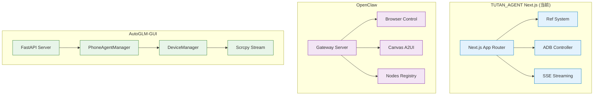

# TUTAN_AGENT Next.js 演进路线图

> **目标**: 对比主流 GUI Agent 框架，明确 TUTAN_AGENT Next.js 的定位、缺失功能与演进方向  
> **适用场景**: 主要用于 Android GUI 自动化  
> **最后更新**: 2025年

---

## 目录

1. [框架对比矩阵](#1-框架对比矩阵)
2. [当前实现状态](#2-当前实现状态)
3. [缺失功能分析](#3-缺失功能分析)
4. [演进路线图 (Phases)](#4-演进路线图-phases)
5. [技术选型建议](#5-技术选型建议)
6. [优先级排序](#6-优先级排序)

---

## 1. 框架对比矩阵

### 1.1 核心能力对比

| 能力维度 | TUTAN_AGENT (Next.js) | OpenClaw | AutoGLM-GUI | MAI-UI | UI-TARS-desktop |
|---------|---------------------|----------|-------------|--------|----------------|
| **感知技术** | ✅ Ref System (ADB XML) | ✅ Ref System (CDP) | ⚠️ 视觉模型 + 坐标 | ✅ 纯视觉模型 | ✅ UI-TARS 模型 |
| **执行技术** | ✅ ADB Shell | ✅ Playwright/CDP | ✅ ADB Shell | ✅ 平台原生 API | ✅ nut-js / Operator |
| **实时画面** | ✅ Scrcpy (已集成) | ✅ Canvas (A2UI) | ✅ Scrcpy 视频流 | ❌ 无 | ❌ 无 |
| **多设备管理** | ✅ 基础支持 | ✅ Node Registry | ✅ DeviceManager | ❌ 无 | ❌ 无 |
| **智能降级** | ✅ 混合控制 (Acc/ADB) | ✅ 多模式支持 | ❌ 无 | ❌ 无 | ❌ 无 |
| **会话管理** | ❌ 内存中 | ✅ Session Manager | ❌ 无 | ❌ 无 | ❌ 无 |
| **定时任务** | ❌ 无 | ✅ Cron Manager | ✅ APScheduler | ❌ 无 | ❌ 无 |
| **工作流** | ❌ 无 | ✅ 插件系统 | ✅ Workflow Manager | ❌ 无 | ❌ 无 |
| **视觉模型** | ❌ 无 | ❌ 无 | ✅ GRS AI | ✅ MAI-UI Model | ✅ UI-TARS Model |
| **测试覆盖** | ✅ Vitest (85%) | ✅ Vitest | ⚠️ Pytest | ❌ 无 | ❌ 无 |
| **部署方式** | ✅ 单 npm 包 | ⚠️ Gateway + Nodes | ✅ Python 环境 | ⚠️ 需要 GPU | ⚠️ 需要模型服务 |

**图例**: ✅ 已实现 | 🟡 部分实现 | ⚠️ 有但不够完善 | ❌ 未实现

### 1.2 架构对比



---

## 2. 当前实现状态

### 2.1 已完成功能 ✅

| 功能模块 | 实现状态 | 说明 |
|---------|---------|------|
| **Ref System** | ✅ 完成 | XML 解析、Ref ID 生成、坐标反查 |
| **XML Parser** | ✅ 完成 | 高性能递归解析 Android UI XML |
| **Planner** | ✅ 完成 | LLM 规划器，支持 JSON 格式输出 |
| **Agent Core** | ✅ 完成 | 异步流式执行，支持 SSE |
| **Action Executor** | ✅ 完成 | Click, Type, Scroll, Back, Home 等 |
| **ADB Wrapper** | ✅ 完成 | 设备控制、截图、输入操作 |
| **Scrcpy Manager** | ✅ 完成 | 后端逻辑完成，前端已集成 ScrcpyPlayer |
| **基础 UI** | ✅ 完成 | 设备管理、Agent 控制台、实时流预览 |
| **测试覆盖** | ✅ 85% | Vitest 单元测试 |

### 2.2 部分实现功能 🟡

| 功能模块 | 实现程度 | 缺失部分 |
|---------|---------|---------|
| **实时画面流** | ✅ 100% | 已实现 H.264 数据传输与前端展示 |
| **多设备管理** | ✅ 80% | 已支持多设备连接与 Agent 实例管理 |
| **会话管理** | 10% | 仅内存中的 history，无持久化 |

---

## 3. 缺失功能分析

### 3.1 核心缺失功能（高优先级）

#### 3.1.1 多设备并发管理
**对比**: AutoGLM-GUI 有 `PhoneAgentManager` 和 `DeviceManager`  
**缺失**: 
- 设备级锁（确保同一设备不并发执行）
- Agent 生命周期管理（创建、销毁、状态跟踪）
- 多设备状态隔离

**影响**: 无法同时控制多个 Android 设备

#### 3.1.2 智能降级策略
**对比**: Open-AutoGLM-Hybrid 有 Accessibility → ADB → UIAutomator 降级  
**状态**: ✅ 已在 `DeviceController` 中实现基础降级逻辑。

#### 3.1.3 实时画面流完整集成
**对比**: AutoGLM-GUI 有完整的 scrcpy 视频流  
**状态**: ✅ 已集成 Scrcpy-server 3.3.3，支持 Socket.IO 转发与前端预览。

#### 3.1.4 会话持久化
**对比**: OpenClaw 有 Session Store  
**缺失**: 
- 任务历史持久化（数据库或文件）
- 会话恢复能力
- 任务中止与恢复

**影响**: 无法保存和恢复任务状态

### 3.2 增强功能（中优先级）

#### 3.2.1 视觉模型集成（可选）
**对比**: MAI-UI、UI-TARS-desktop 有视觉模型  
**优势**: 提高准确率（95-99%）  
**代价**: 需要 GPU 资源和模型服务

#### 3.2.2 定时任务（Cron）
**对比**: AutoGLM-GUI 有 APScheduler  
**缺失**: 定时执行任务的能力

#### 3.2.3 工作流管理
**对比**: AutoGLM-GUI 有 Workflow Manager  
**缺失**: 复杂任务编排能力

#### 3.2.4 视觉调试工具
**对比**: OpenClaw 有 Ref ID 覆盖显示  
**缺失**: 在实时画面上显示 Ref ID 标签

### 3.3 高级功能（低优先级）

#### 3.3.1 Canvas/A2UI 动态 UI
**对比**: OpenClaw 有 A2UI 协议  
**说明**: 主要用于桌面端，Android 场景需求较低

#### 3.3.2 多 Profile 隔离
**对比**: OpenClaw 有 Browser Profile 隔离  
**说明**: Android 场景可通过多设备实现

#### 3.3.3 WebSocket 实时通信
**对比**: OpenClaw 有 WebSocket + ACP 协议  
**说明**: 当前 SSE/Socket.IO 已足够，WebSocket 可后续优化

---

## 4. 演进路线图 (Phases)

### Phase 1: 核心能力完善 (已完成 ✅)
**目标**: 建立稳定的工程底座与感知系统
- [x] **Ref System**: 语义引用 ID 生成与解析
- [x] **Hybrid Control**: 无障碍服务与 ADB 的智能降级切换
- [x] **Real-time Stream**: Scrcpy 3.3.3 集成与前端 H.264 渲染
- [x] **Agent Core**: 基础任务规划与异步流式执行

### Phase 2: 记忆与持久化 (当前重点 🎯)
**目标**: 让 Agent 具备“长记性”和“断点续传”能力
- [ ] **Session Persistence**: 集成 SQLite，持久化存储任务历史与 Agent 状态
- [ ] **Context Recovery**: 支持页面刷新或服务重启后的会话自动恢复
- [ ] **Knowledge Base**: 允许用户上传特定 App 的操作指南作为 Agent 的先验知识

### Phase 3: 视觉增强与调试 (提升体验 🛠️)
**目标**: 强化视觉反馈，降低调试门槛
- [ ] **Ref Overlay**: 在 Scrcpy 实时画面上动态覆盖显示 Ref ID 标签
- [ ] **Visual Debugger**: 实时显示 LLM 的思考过程与动作轨迹的视觉连线
- [ ] **Hybrid Snapshot**: 结合无障碍树与视觉模型 (VLM) 的混合定位方案

### Phase 4: 自动化编排 (生产级扩展 🚀)
**目标**: 从“单次任务”转向“复杂工作流”
- [ ] **Workflow Engine**: 支持 JSON 定义的复杂多步工作流 (顺序/分支/循环)
- [ ] **Cron Scheduler**: 定时任务管理，支持每日自动签到、数据采集等场景
- [ ] **Multi-Device Sync**: 多设备协同工作，支持跨设备任务分发与状态同步

---

## 5. 技术选型建议

### 5.1 多设备管理

**方案 A: 单例模式（推荐）**
```typescript
class DeviceAgentManager {
  private static instance: DeviceAgentManager;
  private agents: Map<string, TutanAgent> = new Map();
  private locks: Map<string, Mutex> = new Map();
  
  async useAgent(deviceId: string, callback: (agent: TutanAgent) => Promise<void>) {
    const lock = this.getLock(deviceId);
    await lock.acquire();
    try {
      const agent = this.getOrCreateAgent(deviceId);
      await callback(agent);
    } finally {
      lock.release();
    }
  }
}
```

**参考库**: `async-mutex` 或 `p-limit`

### 5.2 实时画面流

**方案 A: webcodecs（推荐，现代浏览器）**
```typescript
// 前端解码
const decoder = new VideoDecoder({
  output: (frame) => {
    canvas.getContext('2d').drawImage(frame, 0, 0);
  },
  error: (e) => console.error(e)
});
```

**方案 B: broadway.js（兼容性好）**
```typescript
import { Decoder } from 'broadway.js';
const decoder = new Decoder({
  rgb: true,
  webgl: true
});
```

### 5.3 会话持久化

**方案 A: SQLite（推荐）**
```typescript
import Database from 'better-sqlite3';
const db = new Database('sessions.db');
db.exec(`
  CREATE TABLE IF NOT EXISTS sessions (
    id TEXT PRIMARY KEY,
    device_id TEXT,
    task TEXT,
    history TEXT,
    created_at INTEGER
  )
`);
```

**方案 B: JSON 文件（简单场景）**
```typescript
import fs from 'fs/promises';
const sessions = JSON.parse(await fs.readFile('sessions.json', 'utf-8'));
```

### 5.4 定时任务

**方案 A: node-cron（推荐）**
```typescript
import cron from 'node-cron';
cron.schedule('0 9 * * *', async () => {
  await agent.runTask('每日签到');
});
```

**方案 B: node-schedule（更灵活）**
```typescript
import schedule from 'node-schedule';
schedule.scheduleJob('0 9 * * *', async () => {
  await agent.runTask('每日签到');
});
```

### 5.5 智能降级

**方案: 策略模式**
```typescript
interface ControlStrategy {
  canExecute(): Promise<boolean>;
  execute(action: Action): Promise<boolean>;
}

class ADBStrategy implements ControlStrategy { ... }
class AccessibilityStrategy implements ControlStrategy { ... }

class HybridController {
  private strategies: ControlStrategy[] = [
    new AccessibilityStrategy(),
    new ADBStrategy(),
  ];
  
  async execute(action: Action) {
    for (const strategy of this.strategies) {
      if (await strategy.canExecute()) {
        return await strategy.execute(action);
      }
    }
    throw new Error('No available control strategy');
  }
}
```

---

## 6. 优先级排序

### 6.1 高优先级（必须实现）

1. **多设备并发管理** ⭐⭐⭐⭐⭐
   - **理由**: 生产环境必须支持多设备
   - **状态**: ✅ 已实现基础管理，待完善并发锁。

2. **实时画面流完整集成** ⭐⭐⭐⭐⭐
   - **理由**: 调试和监控的核心功能
   - **状态**: ✅ 已完成。

3. **会话持久化** ⭐⭐⭐⭐
   - **理由**: 任务恢复和审计需要
   - **状态**: ❌ 待实现。

### 6.2 中优先级（强烈建议）

4. **智能降级策略** ⭐⭐⭐⭐
   - **理由**: 提高稳定性和兼容性
   - **状态**: ✅ 已完成。

5. **视觉调试工具** ⭐⭐⭐
   - **理由**: 提升开发体验
   - **状态**: ❌ 待实现。

6. **链路诊断** ⭐⭐⭐
   - **理由**: 生产环境监控需要
   - **状态**: 🟡 基础诊断已实现。

### 6.3 低优先级（可选）

7. **定时任务** ⭐⭐⭐
   - **理由**: 自动化场景需要
   - **状态**: ❌ 待实现。

8. **工作流管理** ⭐⭐
   - **理由**: 复杂任务编排
   - **状态**: ❌ 待实现。

9. **视觉模型集成** ⭐⭐
   - **理由**: 提高准确率（可选）
   - **状态**: ❌ 待实现。

---

## 7. 实施建议

### 7.1 开发顺序

**第一阶段（已完成）**: 核心能力完善
- 多设备管理 + 实时画面流
- 智能降级策略
- 基础 UI 与 Ref 系统

**第二阶段（当前）**: 增强与持久化
- 会话持久化 (SQLite)
- 视觉调试工具 (Ref ID 覆盖)
- 链路诊断完善

**第三阶段**: 高级功能
- 定时任务 + 工作流管理
- 视觉模型集成 (可选)

**第四阶段**: 优化与完善
- 性能优化 + 文档完善

### 7.2 技术债务

1. **Scrcpy Manager 重构**
   - 当前实现较简单，需要完善错误处理和重连逻辑

2. **Ref System 缓存**
   - 当前每次重新解析，需要实现增量更新

3. **ADB 命令优化**
   - 当前串行执行，可以批量优化

### 7.3 测试策略

1. **单元测试**: 保持 85%+ 覆盖率
2. **集成测试**: 多设备场景、降级场景
3. **E2E 测试**: 完整任务执行流程

---

## 8. 总结

### 8.1 当前优势

1. ✅ **Ref System**: 语义引用系统已实现，稳定性高
2. ✅ **全栈集成**: Next.js 一体化架构，部署简单
3. ✅ **测试覆盖**: 85% 覆盖率，质量有保障
4. ✅ **智能降级**: 已支持无障碍服务与 ADB 的混合控制
5. ✅ **实时交互**: Scrcpy 视频流已打通

### 8.2 主要差距

1. ❌ **会话持久化**: 仅内存存储，无法恢复
2. ❌ **视觉调试**: 缺少在画面上直接显示 Ref ID 的工具
3. ❌ **自动化增强**: 缺少定时任务和工作流编排

### 8.3 演进方向

**短期（1个月内）**: 补齐会话持久化与视觉调试工具，达到生产可用  
**中期（2-3个月）**: 添加定时任务与工作流，提升自动化能力  
**长期（6个月+）**: 集成视觉模型，达到 SOTA 性能

---

**文档更新于: 2026年2月11日**
**文档结束**
