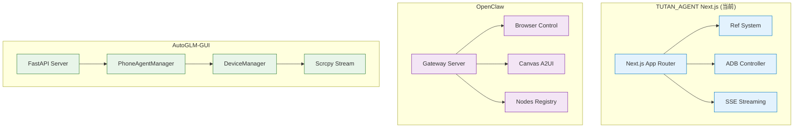

# TUTAN_AGENT Next.js 演进路线图

> **目标**: 对比主流 GUI Agent 框架，明确 TUTAN_AGENT Next.js 的定位、缺失功能与演进方向  
> **适用场景**: 主要用于 Android GUI 自动化  
> **最后更新**: 2025年

---

## 目录

1. [框架对比矩阵](#1-框架对比矩阵)
2. [当前实现状态](#2-当前实现状态)
3. [缺失功能分析](#3-缺失功能分析)
4. [演进路线图 (Phases)](#4-演进路线图-phases)
5. [技术选型建议](#5-技术选型建议)
6. [优先级排序](#6-优先级排序)

---

## 1. 框架对比矩阵

### 1.1 核心能力对比

| 能力维度 | TUTAN_AGENT (Next.js) | OpenClaw | AutoGLM-GUI | MAI-UI | UI-TARS-desktop |
|---------|---------------------|----------|-------------|--------|----------------|
| **感知技术** | ✅ Ref System (ADB XML) | ✅ Ref System (CDP) | ⚠️ 视觉模型 + 坐标 | ✅ 纯视觉模型 | ✅ UI-TARS 模型 |
| **执行技术** | ✅ ADB Shell | ✅ Playwright/CDP | ✅ ADB Shell | ✅ 平台原生 API | ✅ nut-js / Operator |
| **实时画面** | 🟡 Scrcpy (框架已搭建) | ✅ Canvas (A2UI) | ✅ Scrcpy 视频流 | ❌ 无 | ❌ 无 |
| **多设备管理** | ❌ 无 | ✅ Node Registry | ✅ DeviceManager | ❌ 无 | ❌ 无 |
| **智能降级** | ❌ 无 | ✅ 多模式支持 | ❌ 无 | ❌ 无 | ❌ 无 |
| **会话管理** | ❌ 内存中 | ✅ Session Manager | ❌ 无 | ❌ 无 | ❌ 无 |
| **定时任务** | ❌ 无 | ✅ Cron Manager | ✅ APScheduler | ❌ 无 | ❌ 无 |
| **工作流** | ❌ 无 | ✅ 插件系统 | ✅ Workflow Manager | ❌ 无 | ❌ 无 |
| **视觉模型** | ❌ 无 | ❌ 无 | ✅ GRS AI | ✅ MAI-UI Model | ✅ UI-TARS Model |
| **测试覆盖** | ✅ Vitest (85%) | ✅ Vitest | ⚠️ Pytest | ❌ 无 | ❌ 无 |
| **部署方式** | ✅ 单 npm 包 | ⚠️ Gateway + Nodes | ✅ Python 环境 | ⚠️ 需要 GPU | ⚠️ 需要模型服务 |

**图例**: ✅ 已实现 | 🟡 部分实现 | ⚠️ 有但不够完善 | ❌ 未实现

### 1.2 架构对比



---

## 2. 当前实现状态

### 2.1 已完成功能 ✅

| 功能模块 | 实现状态 | 说明 |
|---------|---------|------|
| **Ref System** | ✅ 完成 | XML 解析、Ref ID 生成、坐标反查 |
| **XML Parser** | ✅ 完成 | 高性能递归解析 Android UI XML |
| **Planner** | ✅ 完成 | LLM 规划器，支持 JSON 格式输出 |
| **Agent Core** | ✅ 完成 | 异步流式执行，支持 SSE |
| **Action Executor** | ✅ 完成 | Click, Type, Scroll, Back, Home 等 |
| **ADB Wrapper** | ✅ 完成 | 设备控制、截图、输入操作 |
| **Scrcpy Manager** | 🟡 框架已搭建 | 后端逻辑完成，前端渲染待集成 |
| **基础 UI** | ✅ 完成 | 设备管理、Agent 控制台 |
| **测试覆盖** | ✅ 85% | Vitest 单元测试 |

### 2.2 部分实现功能 🟡

| 功能模块 | 实现程度 | 缺失部分 |
|---------|---------|---------|
| **实时画面流** | 30% | 后端逻辑完成，前端 H.264 解码未实现 |
| **多设备管理** | 20% | 设备列表 API 有，但缺少并发控制 |
| **会话管理** | 10% | 仅内存中的 history，无持久化 |

---

## 3. 缺失功能分析

### 3.1 核心缺失功能（高优先级）

#### 3.1.1 多设备并发管理
**对比**: AutoGLM-GUI 有 `PhoneAgentManager` 和 `DeviceManager`  
**缺失**: 
- 设备级锁（确保同一设备不并发执行）
- Agent 生命周期管理（创建、销毁、状态跟踪）
- 多设备状态隔离

**影响**: 无法同时控制多个 Android 设备

#### 3.1.2 智能降级策略
**对比**: Open-AutoGLM-Hybrid 有 Accessibility → ADB → UIAutomator 降级  
**缺失**:
- 无障碍服务检测
- 自动降级逻辑
- 多模式切换

**影响**: 某些场景下（如安全页面）ADB 可能失效

#### 3.1.3 实时画面流完整集成
**对比**: AutoGLM-GUI 有完整的 scrcpy 视频流  
**缺失**:
- 前端 H.264 解码（webcodecs 或 broadway.js）
- 视频流稳定性优化
- 低延迟控制

**影响**: 无法实时看到设备画面，调试困难

#### 3.1.4 会话持久化
**对比**: OpenClaw 有 Session Store  
**缺失**:
- 任务历史持久化（数据库或文件）
- 会话恢复能力
- 任务中止与恢复

**影响**: 无法保存和恢复任务状态

### 3.2 增强功能（中优先级）

#### 3.2.1 视觉模型集成（可选）
**对比**: MAI-UI、UI-TARS-desktop 有视觉模型  
**优势**: 提高准确率（95-99%）  
**代价**: 需要 GPU 资源和模型服务

#### 3.2.2 定时任务（Cron）
**对比**: AutoGLM-GUI 有 APScheduler  
**缺失**: 定时执行任务的能力

#### 3.2.3 工作流管理
**对比**: AutoGLM-GUI 有 Workflow Manager  
**缺失**: 复杂任务编排能力

#### 3.2.4 视觉调试工具
**对比**: OpenClaw 有 Ref ID 覆盖显示  
**缺失**: 在实时画面上显示 Ref ID 标签

### 3.3 高级功能（低优先级）

#### 3.3.1 Canvas/A2UI 动态 UI
**对比**: OpenClaw 有 A2UI 协议  
**说明**: 主要用于桌面端，Android 场景需求较低

#### 3.3.2 多 Profile 隔离
**对比**: OpenClaw 有 Browser Profile 隔离  
**说明**: Android 场景可通过多设备实现

#### 3.3.3 WebSocket 实时通信
**对比**: OpenClaw 有 WebSocket + ACP 协议  
**说明**: 当前 SSE 已足够，WebSocket 可后续优化

---

## 4. 演进路线图 (Phases)

### Phase 1: 核心能力完善（1-2周）
**目标**: 补齐核心缺失功能，达到生产可用

#### 1.1 多设备并发管理
- [ ] 实现 `DeviceAgentManager`（类似 PhoneAgentManager）
  - 设备级锁（RLock）
  - Agent 生命周期管理
  - 状态机（IDLE/BUSY/ERROR）
- [ ] 实现 `DeviceManager`（多设备管理）
  - 设备发现与连接
  - 状态轮询
  - 连接池管理

**参考**: AutoGLM-GUI 的 `phone_agent_manager.py` 和 `device_manager.py`

#### 1.2 实时画面流完整集成
- [ ] 前端 H.264 解码
  - 集成 `webcodecs` 或 `broadway.js`
  - 实现视频流渲染组件
- [ ] 优化 Scrcpy Manager
  - 错误处理与重连
  - 流稳定性优化
  - 低延迟控制

**参考**: AutoGLM-GUI 的 scrcpy 集成方式

#### 1.3 会话持久化
- [ ] 实现 Session Store
  - 使用 SQLite 或 JSON 文件存储
  - 任务历史记录
  - 会话恢复 API

**参考**: OpenClaw 的 Session Store 设计

### Phase 2: 智能降级与增强（1-2周）
**目标**: 提高稳定性和可靠性

#### 2.1 智能降级策略
- [ ] 实现 `HybridController`
  - AccessibilityService 检测
  - ADB 降级逻辑
  - 自动模式切换
- [ ] 集成 Android Helper App（可选）
  - 无障碍服务实现
  - HTTP API 桥接

**参考**: Open-AutoGLM-Hybrid 的降级逻辑

#### 2.2 视觉调试工具
- [ ] 实现 Ref ID 覆盖显示
  - 在实时画面上绘制 Ref ID 标签
  - 点击高亮
  - 元素边界显示

**参考**: OpenClaw 的视觉调试工具

#### 2.3 链路诊断
- [ ] 实现诊断面板
  - ADB 状态监控
  - 延迟统计
  - LLM 响应时间
  - 错误日志聚合

### Phase 3: 高级功能扩展（2-3周）
**目标**: 添加生产级功能

#### 3.1 定时任务（Cron）
- [ ] 集成 `node-cron` 或 `node-schedule`
- [ ] 实现定时任务 API
  - 创建/删除/更新任务
  - 任务执行历史
  - 任务状态监控

**参考**: AutoGLM-GUI 的 `scheduled_tasks.py`

#### 3.2 工作流管理
- [ ] 实现 Workflow Engine
  - 任务编排（顺序/并行/条件）
  - 工作流定义（JSON/YAML）
  - 工作流执行与监控

**参考**: AutoGLM-GUI 的 `workflows.py`

#### 3.3 视觉模型集成（可选）
- [ ] 集成 UI-TARS 或 MAI-UI
  - 模型服务调用
  - 视觉定位功能
  - 混合快照（无障碍树 + 视觉）

**参考**: UI-TARS-desktop 的模型集成方式

### Phase 4: 优化与完善（1-2周）
**目标**: 性能优化和用户体验提升

#### 4.1 性能优化
- [ ] XML 解析优化
  - 增量解析
  - 缓存机制
- [ ] ADB 命令优化
  - 命令池化
  - 批量操作
- [ ] LLM 调用优化
  - 请求去重
  - 响应缓存

#### 4.2 用户体验
- [ ] 前端 UI 优化
  - 响应式设计
  - 暗色主题
  - 快捷键支持
- [ ] 错误处理优化
  - 友好的错误提示
  - 自动重试机制
  - 错误恢复建议

#### 4.3 文档与测试
- [ ] 完善文档
  - API 文档
  - 使用指南
  - 最佳实践
- [ ] 提高测试覆盖率
  - 目标: 90%+
  - 集成测试
  - E2E 测试

---

## 5. 技术选型建议

### 5.1 多设备管理

**方案 A: 单例模式（推荐）**
```typescript
class DeviceAgentManager {
  private static instance: DeviceAgentManager;
  private agents: Map<string, TutanAgent> = new Map();
  private locks: Map<string, Mutex> = new Map();
  
  async useAgent(deviceId: string, callback: (agent: TutanAgent) => Promise<void>) {
    const lock = this.getLock(deviceId);
    await lock.acquire();
    try {
      const agent = this.getOrCreateAgent(deviceId);
      await callback(agent);
    } finally {
      lock.release();
    }
  }
}
```

**参考库**: `async-mutex` 或 `p-limit`

### 5.2 实时画面流

**方案 A: webcodecs（推荐，现代浏览器）**
```typescript
// 前端解码
const decoder = new VideoDecoder({
  output: (frame) => {
    canvas.getContext('2d').drawImage(frame, 0, 0);
  },
  error: (e) => console.error(e)
});
```

**方案 B: broadway.js（兼容性好）**
```typescript
import { Decoder } from 'broadway.js';
const decoder = new Decoder({
  rgb: true,
  webgl: true
});
```

### 5.3 会话持久化

**方案 A: SQLite（推荐）**
```typescript
import Database from 'better-sqlite3';
const db = new Database('sessions.db');
db.exec(`
  CREATE TABLE IF NOT EXISTS sessions (
    id TEXT PRIMARY KEY,
    device_id TEXT,
    task TEXT,
    history TEXT,
    created_at INTEGER
  )
`);
```

**方案 B: JSON 文件（简单场景）**
```typescript
import fs from 'fs/promises';
const sessions = JSON.parse(await fs.readFile('sessions.json', 'utf-8'));
```

### 5.4 定时任务

**方案 A: node-cron（推荐）**
```typescript
import cron from 'node-cron';
cron.schedule('0 9 * * *', async () => {
  await agent.runTask('每日签到');
});
```

**方案 B: node-schedule（更灵活）**
```typescript
import schedule from 'node-schedule';
schedule.scheduleJob('0 9 * * *', async () => {
  await agent.runTask('每日签到');
});
```

### 5.5 智能降级

**方案: 策略模式**
```typescript
interface ControlStrategy {
  canExecute(): Promise<boolean>;
  execute(action: Action): Promise<boolean>;
}

class ADBStrategy implements ControlStrategy { ... }
class AccessibilityStrategy implements ControlStrategy { ... }

class HybridController {
  private strategies: ControlStrategy[] = [
    new AccessibilityStrategy(),
    new ADBStrategy(),
  ];
  
  async execute(action: Action) {
    for (const strategy of this.strategies) {
      if (await strategy.canExecute()) {
        return await strategy.execute(action);
      }
    }
    throw new Error('No available control strategy');
  }
}
```

---

## 6. 优先级排序

### 6.1 高优先级（必须实现）

1. **多设备并发管理** ⭐⭐⭐⭐⭐
   - **理由**: 生产环境必须支持多设备
   - **工作量**: 1周
   - **依赖**: 无

2. **实时画面流完整集成** ⭐⭐⭐⭐⭐
   - **理由**: 调试和监控的核心功能
   - **工作量**: 1周
   - **依赖**: Scrcpy Manager（已有框架）

3. **会话持久化** ⭐⭐⭐⭐
   - **理由**: 任务恢复和审计需要
   - **工作量**: 3天
   - **依赖**: 无

### 6.2 中优先级（强烈建议）

4. **智能降级策略** ⭐⭐⭐⭐
   - **理由**: 提高稳定性和兼容性
   - **工作量**: 1周
   - **依赖**: Android Helper App（可选）

5. **视觉调试工具** ⭐⭐⭐
   - **理由**: 提升开发体验
   - **工作量**: 3天
   - **依赖**: 实时画面流

6. **链路诊断** ⭐⭐⭐
   - **理由**: 生产环境监控需要
   - **工作量**: 3天
   - **依赖**: 无

### 6.3 低优先级（可选）

7. **定时任务** ⭐⭐⭐
   - **理由**: 自动化场景需要
   - **工作量**: 3天
   - **依赖**: 无

8. **工作流管理** ⭐⭐
   - **理由**: 复杂任务编排
   - **工作量**: 1周
   - **依赖**: 无

9. **视觉模型集成** ⭐⭐
   - **理由**: 提高准确率（可选）
   - **工作量**: 2周
   - **依赖**: 模型服务

---

## 7. 实施建议

### 7.1 开发顺序

**第一阶段（2-3周）**: 核心能力完善
- Week 1: 多设备管理 + 实时画面流
- Week 2: 会话持久化 + 智能降级
- Week 3: 视觉调试工具 + 链路诊断

**第二阶段（2-3周）**: 高级功能
- Week 4-5: 定时任务 + 工作流管理
- Week 6: 视觉模型集成（可选）

**第三阶段（1周）**: 优化与完善
- Week 7: 性能优化 + 文档完善

### 7.2 技术债务

1. **Scrcpy Manager 重构**
   - 当前实现较简单，需要完善错误处理和重连逻辑

2. **Ref System 缓存**
   - 当前每次重新解析，需要实现增量更新

3. **ADB 命令优化**
   - 当前串行执行，可以批量优化

### 7.3 测试策略

1. **单元测试**: 保持 85%+ 覆盖率
2. **集成测试**: 多设备场景、降级场景
3. **E2E 测试**: 完整任务执行流程

---

## 8. 总结

### 8.1 当前优势

1. ✅ **Ref System**: 语义引用系统已实现，稳定性高
2. ✅ **全栈集成**: Next.js 一体化架构，部署简单
3. ✅ **测试覆盖**: 85% 覆盖率，质量有保障
4. ✅ **异步流式**: 支持 SSE，用户体验好

### 8.2 主要差距

1. ❌ **多设备管理**: 缺少并发控制和生命周期管理
2. ❌ **实时画面**: 前端解码未完成
3. ❌ **智能降级**: 只有 ADB，缺少降级策略
4. ❌ **会话持久化**: 仅内存存储，无法恢复

### 8.3 演进方向

**短期（1-2个月）**: 补齐核心功能，达到生产可用  
**中期（3-6个月）**: 添加高级功能，提升用户体验  
**长期（6-12个月）**: 集成视觉模型，达到 SOTA 性能

---

**文档结束**
