# 🦞 OpenClaw 架构解析与 GUI 能力专题文档

> **版本**: 基于 OpenClaw 2026.2.6-3
> **作者**: Auto (AI Assistant)
> **最后更新**: 2025年

本文档深入解析 OpenClaw 的核心架构设计，并详细探讨其在浏览器自动化、桌面应用交互及移动端 GUI 操控方面的技术实现。

---

## 目录

1. [核心架构概述](#1-核心架构概述)
2. [Gateway 网关层详解](#2-gateway-网关层详解)
3. [Agent 代理层详解](#3-agent-代理层详解)
4. [Channels 渠道层详解](#4-channels-渠道层详解)
5. [GUI 能力专题](#5-gui-能力专题)
   - [5.1 浏览器自动化系统](#51-浏览器自动化系统)
   - [5.2 Canvas (A2UI) 动态交互界面](#52-canvas-a2ui-动态交互界面)
   - [5.3 桌面应用与系统集成](#53-桌面应用与系统集成)
   - [5.4 移动端节点能力](#54-移动端节点能力)
6. [安全与审批机制](#6-安全与审批机制)
7. [协议与通信](#7-协议与通信)
8. [总结](#8-总结)

---

## 1. 核心架构概述

OpenClaw 采用**分布式控制平面架构**，将 AI 的推理能力（Agent）与执行能力（Nodes）完全解耦。这种设计使得系统具备极高的可扩展性和灵活性。

### 1.1 整体架构图

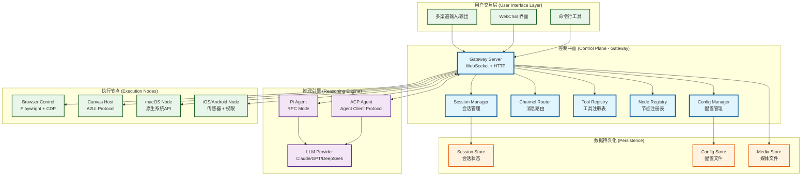

### 1.2 核心设计原则

1. **本地优先 (Local-first)**: 所有敏感数据（会话历史、配置）存储在用户本地，不依赖云端服务。
2. **协议驱动**: 基于 WebSocket 的双向通信，支持实时事件推送和 RPC 调用。
3. **多租户隔离**: 通过 Session 和 Workspace 实现不同任务之间的完全隔离。
4. **可扩展性**: 通过插件系统（Plugins）和技能系统（Skills）实现功能扩展。

---

## 2. Gateway 网关层详解

Gateway 是 OpenClaw 的**控制中枢**，负责协调所有子系统。它运行在用户的本地设备上，默认监听 `ws://127.0.0.1:18789`。

### 2.1 Gateway 核心组件

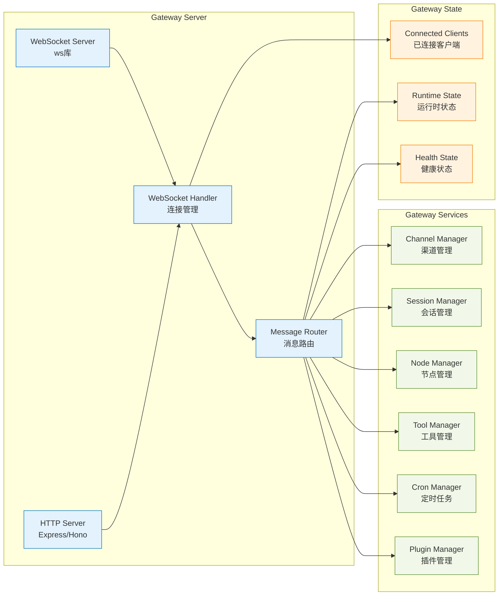

### 2.2 WebSocket 连接管理

Gateway 使用 `ws` 库实现 WebSocket 服务器，支持以下类型的客户端连接：

1. **Agent 客户端**: Pi Agent 或 ACP Agent，通过 RPC 模式连接
2. **Node 客户端**: macOS/iOS/Android 节点，注册系统能力
3. **WebChat 客户端**: 浏览器中的 WebChat 界面
4. **CLI 客户端**: 命令行工具，用于管理 Gateway

**连接生命周期**:

```typescript
// 伪代码示例：Gateway WebSocket 连接处理
async function handleWebSocketConnection(socket: WebSocket) {
  // 1. 认证阶段
  const auth = await authenticateConnection(socket);
  if (!auth.success) {
    socket.close(1008, "Authentication failed");
    return;
  }

  // 2. 注册客户端类型
  const clientType = await identifyClientType(socket);
  const client = registerClient({
    socket,
    type: clientType, // 'agent' | 'node' | 'webchat' | 'cli'
    auth,
  });

  // 3. 订阅事件
  client.subscribeToEvents(['session.*', 'node.*', 'channel.*']);

  // 4. 处理消息
  socket.on('message', async (data) => {
    const request = JSON.parse(data);
    const response = await routeMessage(request, client);
    socket.send(JSON.stringify(response));
  });

  // 5. 清理
  socket.on('close', () => {
    unregisterClient(client);
  });
}
```

### 2.3 消息路由机制

Gateway 实现了基于方法名（Method Name）的路由系统。所有请求都遵循以下格式：

```typescript
interface GatewayRequest {
  id: string;           // 请求ID
  method: string;       // 方法名，如 'sessions.send'
  params?: unknown;     // 参数
}

interface GatewayResponse {
  id: string;           // 对应的请求ID
  result?: unknown;     // 成功结果
  error?: {             // 错误信息
    code: number;
    message: string;
  };
}
```

**方法命名规范**:

- `sessions.*`: 会话相关操作
- `channels.*`: 渠道相关操作
- `nodes.*`: 节点相关操作
- `tools.*`: 工具调用
- `config.*`: 配置管理
- `cron.*`: 定时任务

### 2.4 配置管理

Gateway 的配置存储在 `~/.openclaw/gateway.toml`，支持热重载（Hot Reload）。配置结构：

```toml
[gateway]
port = 18789
bind = "loopback"  # loopback | lan | tailnet | auto

[gateway.auth]
token = "your-secret-token"
password = "optional-password"

[browser]
enabled = true
controlPort = 18790
profiles = { default = { headless = false } }

[canvas]
enabled = true
port = 18791
```

---

## 3. Agent 代理层详解

Agent 是 OpenClaw 的"大脑"，负责理解用户意图、制定执行计划并调用工具。

### 3.1 Agent 架构

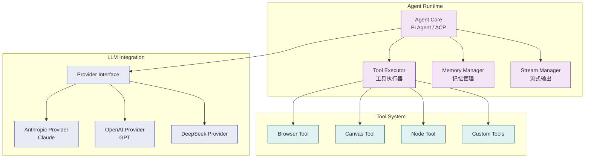

### 3.2 RPC 模式通信

Agent 通过 RPC（Remote Procedure Call）模式与 Gateway 通信：

```typescript
// Agent 调用 Gateway 方法
const response = await gatewayClient.call('sessions.send', {
  sessionKey: 'main',
  message: 'Hello, world!',
  channel: 'telegram',
});

// Gateway 调用 Agent 工具
const toolResult = await agentClient.invokeTool('browser.navigate', {
  url: 'https://example.com',
  profile: 'default',
});
```

### 3.3 工具调用流程

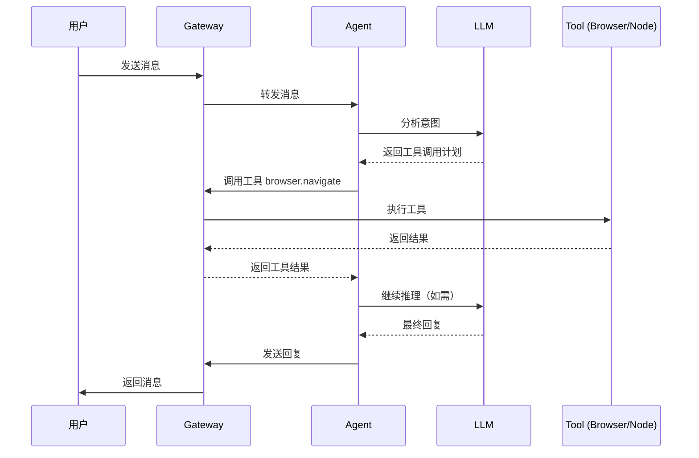

---

## 4. Channels 渠道层详解

Channels 是 OpenClaw 与外部世界交互的接口，支持多种消息平台。

### 4.1 支持的渠道

OpenClaw 支持以下渠道（部分）：

- **即时通讯**: WhatsApp, Telegram, Signal, iMessage, BlueBubbles
- **企业协作**: Slack, Discord, Microsoft Teams, Google Chat
- **其他**: Matrix, Zalo, WebChat

### 4.2 渠道架构

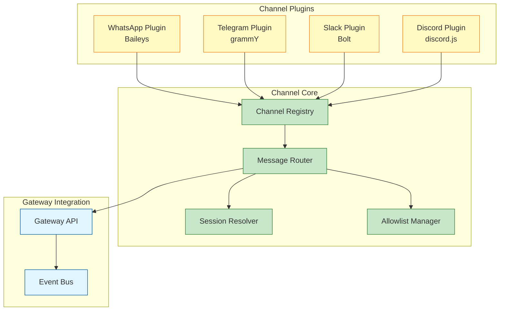

### 4.3 消息路由规则

Gateway 支持基于配置的路由规则：

```toml
[gateway.routing]
# 将 Telegram 的特定群组路由到特定 Agent
[[gateway.routing.rules]]
channel = "telegram"
peer = "group:123456789"
agentId = "work-agent"

# 将 Slack 的 DM 路由到主 Agent
[[gateway.routing.rules]]
channel = "slack"
chatType = "dm"
agentId = "main"
```

---

## 5. GUI 能力专题

OpenClaw 的 GUI 能力是其最核心的竞争力，它使 AI 能够像人类一样观察和操作数字界面。

### 5.1 浏览器自动化系统

#### 5.1.1 技术架构

OpenClaw 的浏览器自动化系统基于 **Playwright** 和 **Chrome DevTools Protocol (CDP)**，实现了工业级的浏览器控制能力。

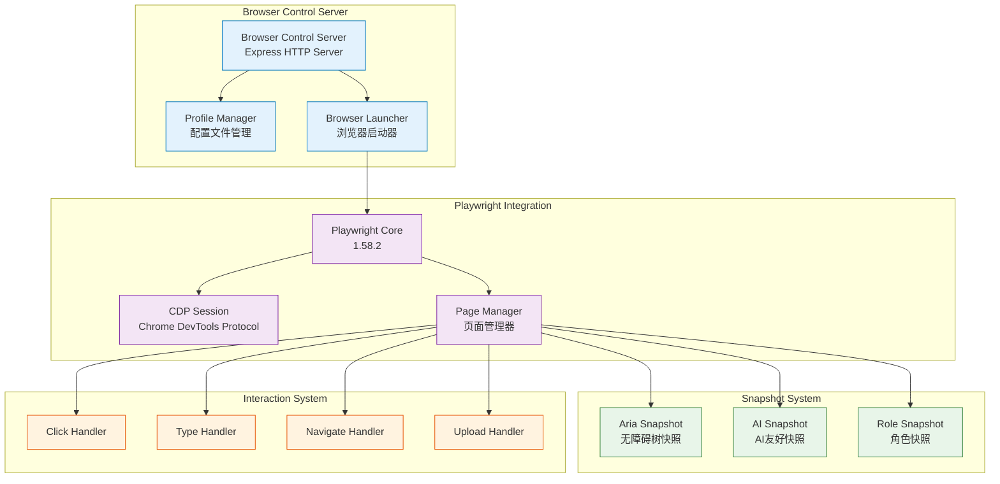

#### 5.1.2 快照系统 (Snapshot System)

OpenClaw 实现了三种快照模式，每种模式针对不同的使用场景：

**1. Aria Snapshot (无障碍树快照)**

```typescript
// 获取页面的无障碍树
const ariaSnapshot = await snapshotAriaViaPlaywright({
  cdpUrl: 'http://127.0.0.1:9222',
  targetId: 'page-target-id',
  limit: 500,  // 限制节点数量
});

// 返回结构
interface AriaSnapshotNode {
  ref: string;              // 引用ID，如 "e1", "e2"
  role: string;             // 角色，如 "button", "textbox"
  name: string;             // 名称/标签
  value?: string;           // 值（如输入框内容）
  description?: string;     // 描述
  depth: number;            // 在树中的深度
}
```

**2. AI Snapshot (AI友好快照)**

AI Snapshot 是 Playwright 内置的 `_snapshotForAI` 方法，生成适合 LLM 理解的页面描述：

```typescript
const aiSnapshot = await snapshotAiViaPlaywright({
  cdpUrl: 'http://127.0.0.1:9222',
  targetId: 'page-target-id',
  timeoutMs: 5000,
  maxChars: 50000,  // 最大字符数
});

// 返回结构
{
  snapshot: string;          // 文本描述
  truncated?: boolean;       // 是否被截断
  refs: {                    // 引用映射
    "e1": { role: "button", name: "Submit" },
    "e2": { role: "textbox", name: "Email" },
  }
}
```

**3. Role Snapshot (角色快照)**

Role Snapshot 结合了 Aria 和 AI Snapshot 的优势，生成结构化的页面描述：

```typescript
const roleSnapshot = await snapshotRoleViaPlaywright({
  cdpUrl: 'http://127.0.0.1:9222',
  targetId: 'page-target-id',
  refsMode: 'role',  // 'role' | 'aria'
  options: {
    includeHidden: false,
    includeText: true,
  },
});

// 返回结构
{
  snapshot: string;          // 格式化的页面描述
  refs: Record<string, { role: string; name?: string; nth?: number }>;
  stats: {
    lines: number;           // 行数
    chars: number;           // 字符数
    refs: number;            // 引用数量
    interactive: number;     // 交互元素数量
  }
}
```

#### 5.1.3 交互系统 (Interaction System)

OpenClaw 实现了完整的浏览器交互能力：

**点击操作**:

```typescript
await clickViaPlaywright({
  cdpUrl: 'http://127.0.0.1:9222',
  targetId: 'page-target-id',
  ref: 'e1',  // 使用快照返回的引用ID
  doubleClick: false,
  button: 'left',  // 'left' | 'right' | 'middle'
  modifiers: ['Control'],  // 修饰键
  timeoutMs: 8000,
});
```

**输入操作**:

```typescript
await typeViaPlaywright({
  cdpUrl: 'http://127.0.0.1:9222',
  targetId: 'page-target-id',
  ref: 'e2',
  text: 'user@example.com',
  submit: false,  // 是否在输入后按 Enter
  slowly: false,  // 是否模拟慢速输入（延迟75ms）
  timeoutMs: 8000,
});
```

**表单填充**:

```typescript
await fillFormViaPlaywright({
  cdpUrl: 'http://127.0.0.1:9222',
  targetId: 'page-target-id',
  fields: [
    { ref: 'e2', type: 'textbox', value: 'user@example.com' },
    { ref: 'e3', type: 'textbox', value: 'password123' },
    { ref: 'e4', type: 'checkbox', value: true },
  ],
  timeoutMs: 8000,
});
```

#### 5.1.4 Profile 管理系统

OpenClaw 支持多个浏览器配置文件，实现会话隔离：

```toml
[browser]
enabled = true
controlPort = 18790

[browser.profiles.default]
headless = false
userDataDir = "~/.openclaw/browser-profiles/default"

[browser.profiles.work]
headless = false
userDataDir = "~/.openclaw/browser-profiles/work"

[browser.profiles.social]
headless = false
userDataDir = "~/.openclaw/browser-profiles/social"
```

每个 Profile 拥有：

- 独立的 Cookie 和登录状态
- 独立的扩展和设置
- 独立的浏览历史

#### 5.1.5 引用系统 (Ref System)

OpenClaw 使用**引用系统**来标识页面元素，而不是传统的 CSS 选择器或 XPath。这有以下优势：

1. **稳定性**: 引用基于元素的语义角色，即使页面结构变化，只要功能不变，引用仍然有效
2. **可读性**: 引用ID（如 `e1`, `e2`）在快照中清晰可见
3. **缓存机制**: 引用会被缓存，即使页面对象变化，引用仍然可用

```typescript
// 引用解析逻辑
function refLocator(page: Page, ref: string): Locator {
  const state = ensurePageState(page);
  const refInfo = state.roleRefs?.[ref];
  
  if (!refInfo) {
    throw new Error(`Ref "${ref}" not found in snapshot`);
  }

  // 根据引用模式选择定位方式
  if (state.roleRefsMode === 'role') {
    // 使用 Playwright 的 getByRole
    return page.getByRole(refInfo.role, { name: refInfo.name, exact: false });
  } else {
    // 使用 aria-ref 属性
    return page.locator(`[aria-ref="${ref}"]`);
  }
}
```

### 5.2 Canvas (A2UI) 动态交互界面

Canvas 是 OpenClaw 独创的交互方式，允许 Agent 在用户屏幕上动态渲染 UI。

#### 5.2.1 A2UI 协议

A2UI (Agent-to-UI) 是一个轻量级的 UI 描述协议，基于 JSON：

```typescript
interface A2UIMessage {
  type: 'push' | 'reset' | 'eval';
  payload: {
    // push: 推送新的 UI 组件
    component?: string;      // React 组件名
    props?: Record<string, unknown>;  // 组件属性
    // reset: 重置画布
    // eval: 执行 JavaScript
    code?: string;
  };
}
```

#### 5.2.2 Canvas Host 架构

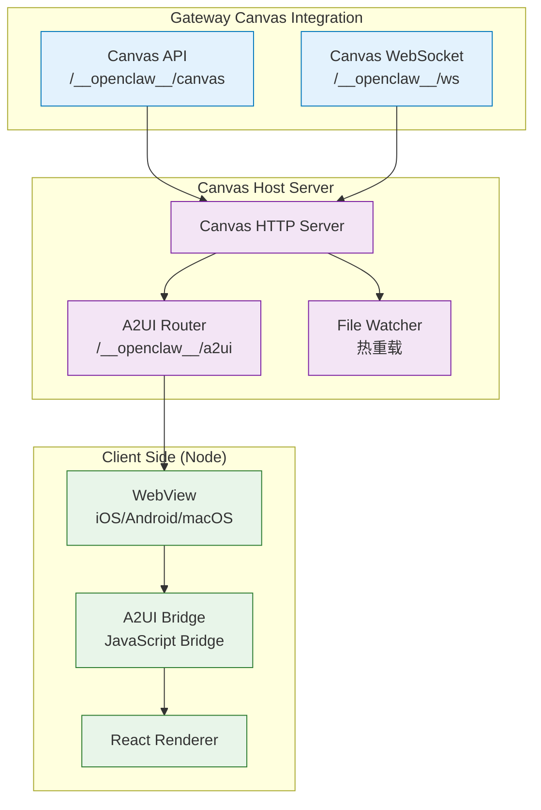

#### 5.2.3 Canvas 使用示例

**Agent 推送 UI**:

```typescript
// Agent 调用 Canvas 工具
await gatewayClient.call('canvas.push', {
  component: 'TaskList',
  props: {
    tasks: [
      { id: 1, title: '完成报告', status: 'pending' },
      { id: 2, title: '回复邮件', status: 'done' },
    ],
  },
});
```

**用户交互反馈**:

```javascript
// 客户端 JavaScript (注入到 Canvas)
globalThis.OpenClaw.sendUserAction({
  id: 'task-click',
  type: 'click',
  taskId: 1,
});
```

**Canvas 响应**:

```typescript
// Gateway 接收用户操作
gateway.on('canvas.userAction', (action) => {
  // 转发给 Agent 处理
  agent.handleUserAction(action);
});
```

### 5.3 桌面应用与系统集成

#### 5.3.1 macOS Node 架构

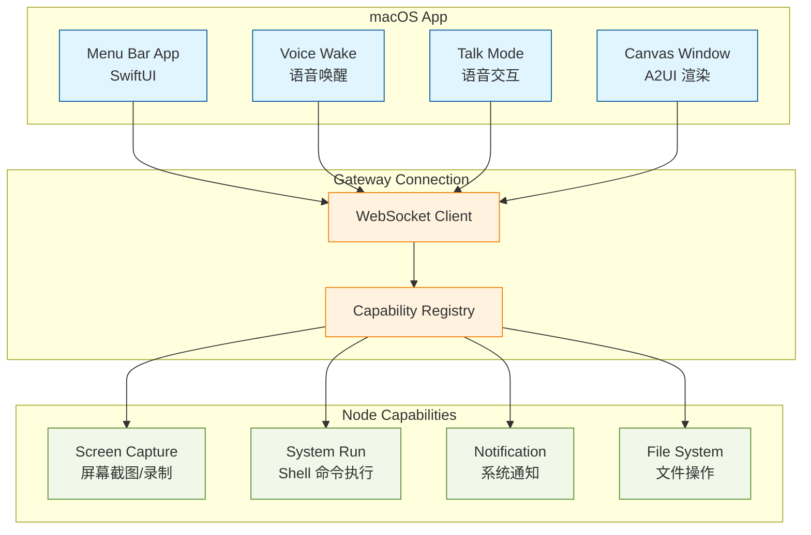

#### 5.3.2 屏幕理解能力

macOS Node 可以捕获屏幕截图，结合视觉大模型（VLM）理解桌面应用：

```typescript
// Agent 调用屏幕截图
const screenshot = await gatewayClient.call('nodes.screen.snap', {
  nodeId: 'macos-node-1',
  format: 'png',
  fullScreen: false,
  region: { x: 0, y: 0, width: 1920, height: 1080 },
});

// 结合 VLM 分析
const analysis = await llm.analyzeImage({
  image: screenshot.data,
  prompt: 'What application is the user currently using?',
});
```

#### 5.3.3 系统命令执行

OpenClaw 支持执行系统命令，但需要用户显式审批：

```typescript
// Agent 请求执行命令
await gatewayClient.call('nodes.system.run', {
  nodeId: 'macos-node-1',
  command: 'ls -la ~/Documents',
  requireApproval: true,  // 需要用户审批
});

// macOS App 显示审批对话框
// 用户点击"允许"后，命令才会执行
```

### 5.4 移动端节点能力

#### 5.4.1 iOS/Android Node 架构

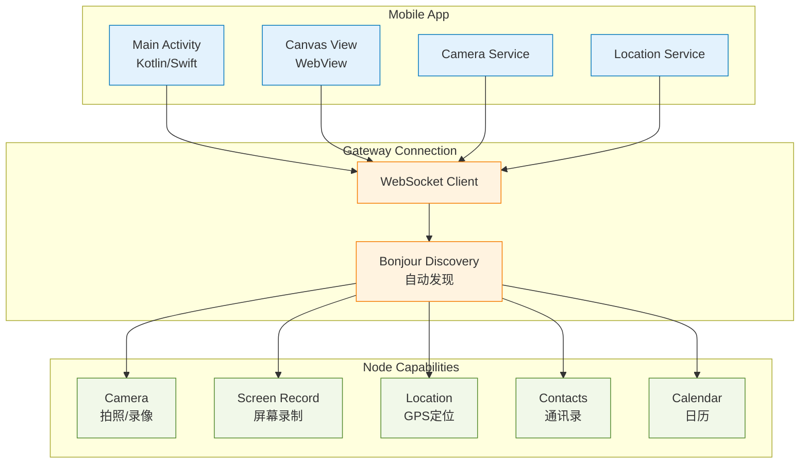

#### 5.4.2 跨设备协同示例

OpenClaw 支持多节点协同工作：

```typescript
// 用户在电脑上问："我桌上这瓶药怎么吃？"
// Agent 执行以下步骤：

// 1. 激活手机的摄像头
const photo = await gatewayClient.call('nodes.camera.snap', {
  nodeId: 'iphone-1',
  quality: 'high',
});

// 2. 使用 VLM 识别药品
const analysis = await llm.analyzeImage({
  image: photo.data,
  prompt: 'Identify this medication and provide usage instructions.',
});

// 3. 在电脑屏幕上显示结果（通过 Canvas）
await gatewayClient.call('canvas.push', {
  component: 'MedicationInfo',
  props: {
    medication: analysis.name,
    instructions: analysis.instructions,
  },
});
```

### 5.5 Playwright Snapshot 与 CDP 技术详解

#### 5.5.1 Playwright Snapshot 的本质

OpenClaw 的浏览器自动化系统同时使用了 **Playwright** 的高级 API 和 **Chrome DevTools Protocol (CDP)** 的底层 API。理解它们的关系对于开发 Android GUI Agent 至关重要。

**关键点**：Playwright Snapshot **不是** Playwright 的原生能力，而是 Playwright 基于 CDP 实现的**高级封装**。

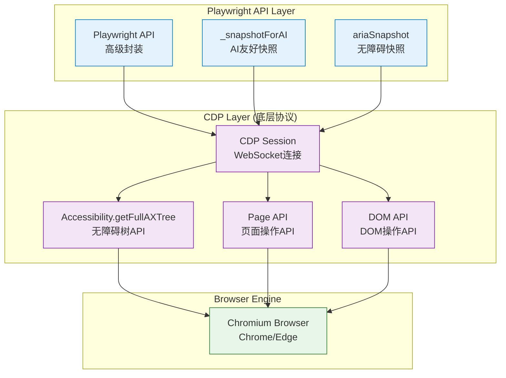

#### 5.5.2 三种快照模式的技术实现

**1. Aria Snapshot - 纯 CDP 实现**

```typescript
// OpenClaw 的实现方式
export async function snapshotAriaViaPlaywright(opts: {
  cdpUrl: string;
  targetId?: string;
  limit?: number;
}): Promise<{ nodes: AriaSnapshotNode[] }> {
  const page = await getPageForTargetId({ cdpUrl, targetId });
  const session = await page.context().newCDPSession(page);
  
  try {
    // 1. 启用无障碍树
    await session.send("Accessibility.enable");
  
    // 2. 通过 CDP 获取完整的无障碍树
    const res = await session.send("Accessibility.getFullAXTree") as {
      nodes?: RawAXNode[];
    };
  
    // 3. 格式化并限制节点数量
    const nodes = Array.isArray(res?.nodes) ? res.nodes : [];
    return { nodes: formatAriaSnapshot(nodes, limit) };
  } finally {
    await session.detach();
  }
}
```

**技术要点**：

- 直接使用 CDP 的 `Accessibility.getFullAXTree` 命令
- 返回的是**原始无障碍树**，包含所有节点的角色、名称、状态
- 适合需要精确控制和分析的场景

**2. AI Snapshot - Playwright 封装**

```typescript
// Playwright 的 _snapshotForAI 方法
const maybe = page as unknown as WithSnapshotForAI;
if (!maybe._snapshotForAI) {
  throw new Error("Playwright _snapshotForAI is not available.");
}

const result = await maybe._snapshotForAI({
  timeout: 5000,
  track: "response",
});
```

**技术要点**：

- `_snapshotForAI` 是 Playwright **内部实现**的方法（非公开 API）
- 底层仍然使用 CDP，但 Playwright 做了**智能优化**：
  - 自动过滤隐藏元素
  - 智能合并相似节点
  - 生成适合 LLM 理解的文本描述
- 需要 Playwright 1.40+ 版本支持

**3. Role Snapshot - 混合模式**

```typescript
// 结合 Aria 和 AI Snapshot 的优势
export async function snapshotRoleViaPlaywright(opts: {
  refsMode?: "role" | "aria";
}) {
  if (opts.refsMode === "aria") {
    // 使用 AI Snapshot（Playwright 封装）
    const result = await page._snapshotForAI();
    return buildRoleSnapshotFromAiSnapshot(result.full);
  } else {
    // 使用 Aria Snapshot（CDP 直接调用）
    const ariaSnapshot = await page.locator(":root").ariaSnapshot();
    return buildRoleSnapshotFromAriaSnapshot(ariaSnapshot);
  }
}
```

#### 5.5.3 CDP 在 Android 上的应用潜力

虽然 CDP 主要针对浏览器，但其**无障碍树（Accessibility Tree）**的概念可以直接应用到 Android GUI Agent：

**Android Accessibility Service 与 CDP 的对应关系**：

| CDP 概念                        | Android 对应                                      |
| ------------------------------- | ------------------------------------------------- |
| `Accessibility.getFullAXTree` | `AccessibilityService.getRootInActiveWindow()`  |
| `AXNode.role`                 | `AccessibilityNodeInfo.getClassName()`          |
| `AXNode.name`                 | `AccessibilityNodeInfo.getText()`               |
| `AXNode.value`                | `AccessibilityNodeInfo.getContentDescription()` |
| `AXNode.bounds`               | `AccessibilityNodeInfo.getBoundsInScreen()`     |

**实现思路**：

```kotlin
// Android 端实现类似 CDP Accessibility API
class AndroidAccessibilityTree {
    fun getFullAXTree(): List<AXNode> {
        val rootNode = accessibilityService.rootInActiveWindow
        return traverseNode(rootNode)
    }
  
    private fun traverseNode(node: AccessibilityNodeInfo?): List<AXNode> {
        if (node == null) return emptyList()
      
        val axNode = AXNode(
            role = node.className.toString(),
            name = node.text?.toString() ?: "",
            value = node.contentDescription?.toString(),
            bounds = node.boundsInScreen,
            children = node.children.map { traverseNode(it) }
        )
      
        return listOf(axNode) + axNode.children.flatten()
    }
}
```

#### 5.5.4 其他 GUI Agent 相关技术

**1. 视觉定位技术 (Visual Grounding)**

OpenClaw 虽然主要使用无障碍树，但也可以结合视觉模型：

```typescript
// 结合截图和 VLM 进行视觉定位
const screenshot = await page.screenshot();
const analysis = await vlm.analyze({
  image: screenshot,
  prompt: "找到登录按钮的位置",
});
// 返回坐标 (x, y)
```

**2. 引用系统 (Ref System) 的稳定性**

OpenClaw 的引用系统通过**缓存机制**保证稳定性：

```typescript
// 引用缓存（即使页面对象变化，引用仍然有效）
const roleRefsByTarget = new Map<string, RoleRefsCacheEntry>();

function rememberRoleRefsForTarget(opts: {
  cdpUrl: string;
  targetId: string;
  refs: RoleRefs;
}) {
  const key = `${normalizeCdpUrl(opts.cdpUrl)}::${opts.targetId}`;
  roleRefsByTarget.set(key, { refs: opts.refs });
}
```

**3. 交互操作的原子性**

OpenClaw 确保每个交互操作都是**原子的**（要么完全成功，要么完全失败）：

```typescript
async function clickViaPlaywright(opts: {
  ref: string;
  timeoutMs?: number;
}) {
  const page = await getPageForTargetId(opts);
  const locator = refLocator(page, opts.ref);
  
  // 使用 Playwright 的自动等待机制
  await locator.click({
    timeout: opts.timeoutMs ?? 8000,
    // 自动等待元素可见、可点击
    force: false,
  });
}
```

**4. 多 Profile 隔离机制**

每个浏览器 Profile 拥有独立的：

- Cookie 和 Session
- 扩展和设置
- 浏览历史
- 本地存储

这为 Android Agent 提供了**多账户管理**的参考思路。

---

## 6. 安全与审批机制

OpenClaw 实现了多层安全机制，确保用户数据和控制权不被滥用。

### 6.1 安全架构

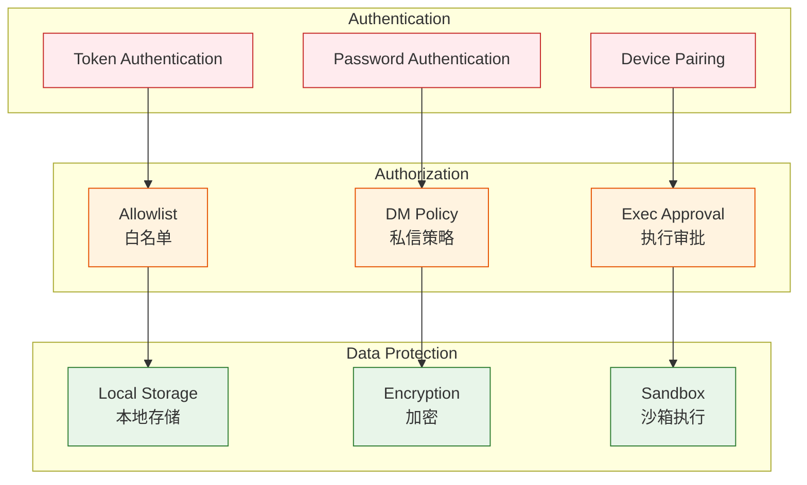

### 6.2 执行审批流程

所有涉及系统修改的操作都需要用户显式审批：

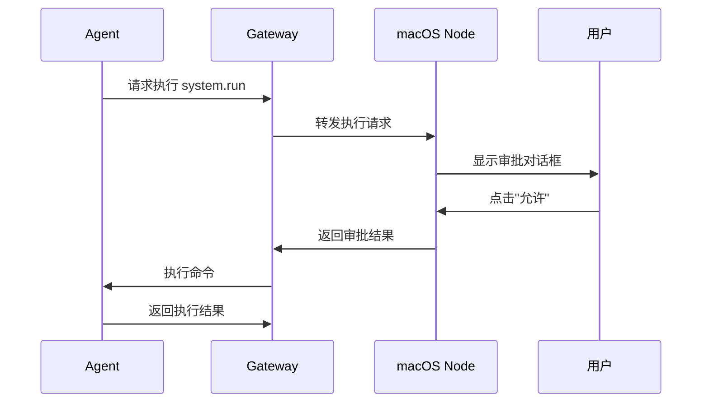

---

## 7. 协议与通信

### 7.1 WebSocket 协议

Gateway 使用 WebSocket 进行双向通信，支持：

- **请求-响应模式**: 标准的 RPC 调用
- **事件推送**: 服务器主动推送事件
- **流式传输**: 支持工具调用的流式结果

### 7.2 Agent Client Protocol (ACP)

OpenClaw 实现了 ACP 协议，这是一个标准化的 Agent 通信协议：

```typescript
// ACP 消息格式
interface ACPMessage {
  jsonrpc: '2.0';
  id?: string | number;
  method?: string;
  params?: unknown;
  result?: unknown;
  error?: {
    code: number;
    message: string;
    data?: unknown;
  };
}
```

### 7.3 工具调用协议

工具调用遵循统一的协议：

```typescript
interface ToolCall {
  name: string;           // 工具名，如 'browser.navigate'
  arguments: unknown;     // 工具参数
  requestId: string;     // 请求ID
}

interface ToolResult {
  requestId: string;     // 对应的请求ID
  result?: unknown;       // 成功结果
  error?: {               // 错误信息
    code: number;
    message: string;
  };
  stream?: boolean;       // 是否为流式结果
}
```

---

## 8. 总结

OpenClaw 通过以下核心设计实现了强大的 GUI 自动化能力：

### 8.1 核心优势

1. **本地优先**: 所有数据存储在用户本地，保护隐私
2. **协议驱动**: 基于 WebSocket 和 ACP 的标准化通信
3. **多端协同**: 支持桌面、移动端和浏览器的统一控制
4. **安全可控**: 多层安全机制和显式审批流程

### 8.2 技术亮点

1. **无障碍树感知**: 使用 Aria Snapshot 实现更精准的页面理解
2. **引用系统**: 基于语义的引用系统，比传统选择器更稳定
3. **Canvas (A2UI)**: 独创的动态 UI 渲染协议
4. **跨设备协同**: 多节点能力共享，实现真正的"具身智能"

### 8.3 应用场景

- **自动化工作流**: 自动处理邮件、消息、任务
- **信息检索**: 在多个网站间搜索和整理信息
- **跨平台操作**: 在电脑和手机间无缝切换任务
- **智能助手**: 理解用户意图，主动执行复杂任务

---

## 附录

### A. 关键文件路径

- Gateway 服务器: `src/gateway/server.impl.ts`
- 浏览器控制: `src/browser/server.ts`
- Canvas Host: `src/canvas-host/server.ts`
- ACP 协议: `src/acp/server.ts`
- macOS Node: `apps/macos/Sources/OpenClaw/`
- iOS Node: `apps/ios/Sources/`
- Android Node: `apps/android/app/src/main/`

### B. 相关文档

- [OpenClaw 官方文档](https://docs.openclaw.ai)
- [Agent Client Protocol 规范](https://github.com/agentclientprotocol/spec)
- [Playwright 文档](https://playwright.dev)

---

**文档结束**
